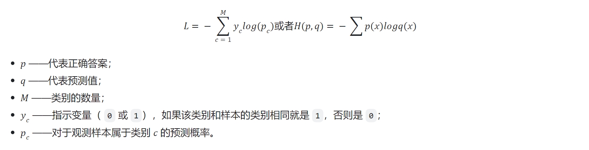

# 自我介绍
面试官您好，我是胡红利，来自湖北十堰，2019年就读于长安大学计算机科学与技术专业，2023年继续在本校攻读硕士学位。
研究生阶段，我专注于计算机视觉与深度学习领域，深入学习了目标检测与位姿估计等视觉算法及相关检测框架，同时，我学习了扩散模型及大模型的相关知识，并且参与了基于扩散模型的目标检测与位姿估计、三维视觉定位等项目。
目前一篇EI会议已发表，一篇ccf-a会议与一篇中文ccf-a期刊在投。在校期间多次参加国家级大赛并获得两项国家级、一项省级等奖项。以上是我的自我介绍，您有需要问的我会认真回答。

# 项目

##  基于单幅RGB图像的单、多目标三维视觉定位方法

鉴于三维视觉定位领域中主流数据集是基于室内场景的且基于单目标，而基于雷达采集架构部署成本高普适性差的问题，我们提出了一个基于RGB图像的单、多目标的三维视觉定位基准数据集，有效地弥补了基于单眼图像的3DVG的研究空白。此外这项工作提出了首个端到端基于单目图像的3DVG框架，旨在有效增强多尺度特征图的语义引导感知。

网络包括三个主要组件：多模态特征提取器，多尺度语义感知分层融合模块以及grounding head。在多模态特征提取器中，使用预训练的 roberta-based 模型提取文本表示序列，使用预训练的深度聚合网络 DLA34 视觉主干提取多尺度特征图。利用 Mamba2 的过滤掉不相关的特征，保留重要的文本序列。随后将文本特征与视觉特征作为状态空间模型的输入，使得输出能够同时保留语义与视觉特征。经过三次迭代，将得到的分层语义表示用作语义指导，增强多尺度特征图的语义感知，最后通过多任务头预测满足语义要求的三维检测结果。

**1) 多模态特征提取器**

**深度聚合网络**

语义融合：在通道方向进行的聚合，能够提高模型推断“是什么”的能力（what）
空间融合：在分辨率和尺度方向的融合，能够提高模型推断“在哪里”的能力（where）

DenseNets 是语义融合的代表，通过跳跃连接所有的层来获得更好的聚合特征和误差。FPNs 是空间融合的代表，通过自上而下和侧边连接来补偿分辨率和标准化金字塔型的层级特征语义。**DLA 则将两者更好地结合起来。**

DLA 核心模块：迭代式深度聚合 IDA 和层级深度聚合 HDA。IDA主要进行跨分辨率和尺度的融合，而HDA主要用于融合各个 module 和 channel 的特征。DA沿着迭代堆叠的backbone进行，依据分辨率对整个网络分stage，越深的stage含有更多的语义信息但空间信息很少。IDA结构，从最浅最小的尺度开始，迭代式地融合更深更大尺度地信息，这样可以使得浅层网络信息在后续stage中获得更多地处理从而得到精炼。尽管IDA可以高效组合stage，但它依然是序列性的，不足以用来融合网络各个block信息。HDA以树的形式合并block和stage来保持和组合特征通道，通过HDA，浅层和深层的网络层可以组合到一起，这样的组合信息可以跨越各个层级从而学得更加丰富。

“聚合”定义为跨越整个网络的多层组合，文中研究的也是那些深度、分辨率、尺度上能有效聚合的一系列网络。由于网络可以包含许多层和连接，模块化的设计可以通过分组和重复来克服复杂度问题。多个layer组合为一个block，多个block再根据分辨率组合为一个stage，DLA则主要探讨block和stage的组合（stage间网络保持一致分辨率，那么空间融合发生在stage间，语义融合发生在stage内）。

**2) 语义感知与融合**

使用roberta-based 模型提取文本表示序列得到浅层次的语义特征，使用三个堆叠的SSD模块递归处理这些语义特征来获得多层次的上下文语义表示并基于选择性机制对无关信息进行过滤，对主干提取到的多尺度特征图进行特征融合，在SSM 模块中，矩阵 B 和步长(∆)从文本嵌入获得，矩阵 C 从视觉嵌入得到，将视觉信息嵌入到状态表示中，最终的输出能够同时捕获视觉特征与语义特征。

**Transformer的问题**：

Transformer 结构的核心在于自注意力机制，它在处理序列数据时，首先通过位置编码将数据空间化，并在有限窗口内计算序列元素之间的关联。然而，这种机制有一个显著的局限性，即它的计算范围仅限于窗口内，无法直接处理窗口外的元素，导致视野狭窄，信息孤立，缺乏全局建模能力。

虽然理论上可以通过增加窗口长度来扩展模型的视野，但这会导致计算复杂度呈平方增长 O(n2)，因为每个位置需要与窗口内的所有其他位置进行比较。此外，Transformer 通过计算空间相关度来建模时序相关度，这种方式忽略了数据内在的细腻结构关联，导致参数效率低，冗余高，训练不易。

这种局限源于当初为了利用 GPU 并行能力而选择的空间化处理方法，而非最佳的时序建模方式。因此，长序列建模逐渐回归传统方法，特别是时序状态空间模型 (SSM)，而其中的 Mamba 模型在这一领域表现出色。

**状态空间模型 (State Space Model)**：

SSM 是一种描述动态系统行为的数学模型，它使用一组一阶微分方程（连续时间系统）或差分方程（离散时间系统）来表示系统的内部状态的演化，同时用另一组方程来描述系统状态和输出之间的关系。其基本形式通过以下状态方程和输出方程表示：

状态方程： $h'(t)=Ah(t)+Bx(t)$
输出方程： $y(t)=Ch'(t)$

SSM 将一个输入向量 $x(t)$ 映射为一个潜在状态变量 $h'(t)$，，然后再映射为一个输出向量 $y(t)$。通过输入信号与隐状态的关系来建模系统的动态行为，并且能够应对时变和非线性系统，因而具有很强的通用性。SSM 模型的核心优势在于其对时序关系的建模和在动态系统中的应用。

**SSM->S4D**

1）**离散数据的连续化：基于零阶保持技术做连续化并采样**。利用零阶保持技术处理离散的输入(如文本序列)。每次收到离散信号时，都会保留其值直到收到新的离散信号，使得 SSM 可以使用连续信号，保持该值的时间由一个新的可学习参数表示，称为步长(∆)。有了连续的输入信号后，便可以生成连续的输出，并且仅根据输入的时间步长对值进行采样。这些采样值即离散输出。最终能够从连续 SSM 转变为离散SSM，使得不再是函数到函数，而是序列到序列。

2）**卷积结构表示：方便并行训练**。图像识别任务中，使用过滤器(即卷积核kernels)来导出聚合特征，而SSM也可以表示成卷积的形式，使用一维卷积核。将 SSM 表示为卷积的一个主要好处是它可以像卷积神经网络CNN一样进行并行训练。然而，由于内核大小固定，它们的推理不如 RNN 那样快速。解决办法：作为从输入信号到输出信号的参数化映射，SSMs可以当做是RNN与CNN的结合，即推理用RNN结构，训练用CNN结构。

3）**长距离依赖问题的解决：HiPPO**。HiPPO 矩阵通常用于将连续时间信号投影到正交多项式基下，以代表过去的状态/信息，尝试将当前看到的所有输入信号压缩为一个系数向量，通过函数逼近产生状态矩阵 A 的最优解。使得在被应用于循环表示和卷积表示中时，可以处理远程依赖性。

4）**S4 与 S4D**。S4：综合SSM + 离散化(可循环表示或卷积表示) + HiPPO 。S4D：将参数矩阵标准化为对角结构。

S4模型使用四个参数（$\Delta A$, $B$, $C$）定义序列到序列的转换过程，分为两个阶段：第一阶段（离散化）：将“连续参数”（$\Delta A$, $B$）转换为“离散参数”（$\bar{A}$, $\bar{B}$）。第二阶段：通过离散化后的参数计算序列转换，可以通过线性递归或全局卷积两种方式实现。

$h_t = \bar{A} h_{t-1} + \bar{B} x_t$

$A$是状态转换矩阵，$B$是输入到状态的转换矩阵，$x(t)$是当前时间步的输入。这表明当前的潜在状态$h(t)$是由前一个时间步的潜在状态$h_{t-1}$和当前输入的组合递归决定决定的。

$y_t = C h_t$

$C$是状态到输出的转换矩阵。输出直接依赖于当前的潜在状态。输出$y_t$是当前潜在状态$h_t$的直接函数。

**Mamba = 有选择处理信息 + 硬件感知算法 + 更简单的SSM架构**

- **选择性状态空间模型**：SSM 中的矩阵A B C不随输入不同而不同，即无法针对不同的输入针对性的推理。Mamba 通过将输入序列的长度和批次大小结合起来，使矩阵 B 和 C，甚至步长 ∆ 都依赖于输入。通过调整 ∆，模型可以控制对当前输入的关注度。
- **硬件感知的设计**：并行扫描(parallel scan)且借鉴Flash Attention。无法使用卷积表示来计算 A B C这些动态矩阵(CNN需要固定的内核)，设计选择性扫描算法实现并行化计算，借助Flash Attention 让传统的SSM在现代GPU上也能高效计算。
- **简化的SSM架构**：将大多数SSM架构的基础块，与现代神经网络比如Transformer中普遍存在的 Gated MLP 相结合，组成新的Mamba块，然后重复这个块(且与归一化和残差连接结合)，便构成了Mamba架构。

**mamba2与mamba的区别**

[mamba2](https://blog.csdn.net/v_JULY_v/article/details/140131413)

mamba的ssm只能在递归模式下进行，而不是卷积形式，mamba2的ssd将A的结构从对角线进一步简化为标量乘以单位矩阵结构，使其能够并行计算。

**多模态特征融合方法**

主要针对文本、语音和图像三者模态数据的融合。

- **数据级融合**: 在最底层的数据级别上进行融合。这种融合方式通常发生在数据预处理阶段，即将来自不同模态的原始数据直接合并或叠加在一起，形成一个新的数据集。
- **特征级融合**: 提取出各自的特征表示，然后将这些特征表示在某一特征层上进行融合。具体来说：首先得到的文本特征ftext，音频特征faudio和视觉特征fvisual，然后将三个特征连接得到融合后的特征funion，最后输入MLP和softmax层得到分类结果。然而，特征融合的局限性在于生成的高维特征向量，并且由于它以一种直接的方式融合了三种模态特征，不能对复杂的关系进行建模。
- **决策级融合**: 在各个单模态模型分别做出决策之后进行的融合。每个模态的模型首先独立地处理数据并给出自己的预测结果（如分类标签、回归值等），然后将这些预测结果进行整合以得到最终的决策结果。具体来说，将文本特征ftext、音频特征faudio和视觉特征fvisual分别输入各自的MLP和softmax层进行抑郁症回归训练，预测结果分别为ytext ，yaudio和yvisual。之后将ytext ，yaudio和yvisual进行线性加权求和得到融合结果rf。最后将rf经过softmax层，得到多模态融合的结果。然而，决策级融合无法捕捉不同模态之间的相互关联，因为这些模态被假定为独立的。
- **模型级融合**: 旨在获得三种模态的联合特征表示，它的实现主要取决于使用的融合模型。融合思路如下：将文本特征输入到第一层LSTM（Layer1）得到的是每个神经元的隐藏层状态，然后将音频特征与Layer1得到的隐藏层状态相拼接输入到第二层LSTM（Layer2）得到第二层每个神经元的隐藏层状态，之后将视觉特征与Layer2得到的隐藏层状态相拼接输入到第二层LSTM（Layer3）得到第三层每个神经元的隐藏层状态，最后将融合后的特征输入到FC层得到最终的预测结果。

基于深度学习的模型级融合方法：

- **DSSM**：通过用 DNN 把不同的模态数据 表达为低维语义向量，并通过 cosine 距离来计算两个语义向量的距离，最终训练出语义相似度模型。
- **AE**：先进行所有模态的encoder，再用decode还原特征，最后计算特征之间的损失。
- **MFN**：使用差分记忆注意力(Delta-memory attention)和多视角门控记(Multi-View Gated Memory)来同时捕捉时序上和模态间的交互，用memory的目的是能保存上一时刻的多模态交互信息，gated过滤，Attention分配权重。通过计算当前时刻输入与记忆库中历史状态的差分向量捕捉时间维度上的状态变化趋势，使用门控注意力机制动态调节历史信息对当前预测的贡献度，通过共享的全局记忆矩阵实现不同模态表征的空间对齐。

## 基于扩散模型的目标检测与位姿估计算法
研究路侧交通场景下仅以单目RGB图像为输入的基于扩散模型的目标检测与位姿估计算法设计与应用，将目标检测与位姿估计转换为图像中边界框的位置和大小空间上的生成模型来解决问题，训练阶段将真值框扩散到随机分布，通过训练模型来逐渐逆转正向过程的影响，模型学习反转这个噪声过程，将一组随机生成的框细化到类别、目标框及位姿的输出结果。

**网络结构**

网络由一个图像编码器和一个多任务解码器组成。图像编码器使用 resnet 提取图像特征，并使用特征图金字塔FPN生成多尺度特征图。多任务解码器的输入为加入噪声后的二维框，从多尺度特征图中裁剪RoI特征，并经过MLP输出目标检测与位姿估计的预测结果。
训练阶段初始化一组2dbox，并逐步加入高斯噪声，得到噪声2dbox，并从图像编码器提取到的特征裁剪出感兴趣区域，将裁剪得到的特征送入到解码器中预测真值并计算loss。
再推理时，生成一组完全由高斯噪声生成的噪声2dbox，接着同样的步骤得到解码器预测的2dbox(xt)，采用ddim传入当前的噪声样本 xt 与预测的目标框 x0，预测上一时刻 xt-1 的数据分布，反复迭代直至0时刻。

**DDIM**

DDIM 通过重新设计前向过程，允许非马尔可夫链的跳跃路径，从而减少反向过程的迭代步数。
假设扩散过程的时间步总数为 T，在前向过程中，直接定义从初始状态 x0 到任意时间步 t 的映射：
$$\mathbf{x}_t = \sqrt{\bar{\alpha}}_t \mathbf{x}_0 + \sqrt{1 - \bar{\alpha}}_t \mathbf{\epsilon}, \quad \mathbf{\epsilon} \sim \mathcal{N}(\mathbf{0}, \mathbf{I})$$

其中，$\bar{\alpha}_t$ 是累积噪声调度参数（与 DDPM 相同）。

在反向过程中，通过预测初始状态 x0 和当前噪声 ${\epsilon}_{t}$ ，直接跳步生成下一步状态xt-1。

**DETR**

DETR 分为四个部分，CNN 的 backbone，Transformer 的 Encoder与Decoder，及预测层 FFN。在Decoder中选择固定的 N 个 token 作为输入，并行解码 N 个object，经过FFN 就能得到 N 个框的位置和类别分数。FFN 是由具有 ReLU 激活函数且具有隐藏层的 3 层线性层组成。DETR 预测了一组固定大小的 N 个边界框，因此将真值也扩展为N个并采用匈牙利算法进行二分图匹配，使得匹配损失最小。

**Sparse rcnn**

由基于ResNet结构的特征金字塔网络的主干网络、一个动态实例交互头和两个任务特定的预测层组成。一共有3个输入：一幅图像、一个建议边界框集合和一个建议特征集合。后两者是可学习的，可以与网络中的其它参数一起优化。可学习的建议边界框是一个固定的（N×4）集合，提供粗糙的目标位置。可学习的建议特征（N×d）是一个高维的潜在向量，被期望于对丰富的实例特征进行编码。 给定 N 个建议边界框，Sparse R-CNN首先利用池化操作为每个边界框提取特征，每个RoI特征被输入动态实例交互头进行目标定位和分类。头是一组可迭代的同样结构的交互头，上一个head的输出特征与2dboxes作为下一个头的输入特征和2dboxes。

## 基于轨迹时空图的无监督异常检测方法
基于工业领域无监督异常检测方法EfficientAD进行改进。EfficientAD由一个学生教师对和一个自编码器组成，自动编码器检测逻辑异常(产品的组装错误...)，而学生-教师模型检测粗粒度和细粒度的结构异常(产品物理缺陷...)。异常图是两个输出之间的平方差。将学生-教师对生成的异常图称为局部异常图，学生-自编码器生成的异常图称为全局异常图，取这两个异常图的均值来计算合并的异常图，并将其最大值作为图像级异常评分。使用注意力模块替换自编码器，在使用线性注意力模块时，取得了最佳性能。

**PDN(TS架构)**

特征提取器仅由四个卷积层组成，以完全卷积方式将其应用于图像可以在一次前向传递中产生所有特征。为了使 PDN 生成富有表现力的特征，将深度预训练分类网络提炼到其中。使用与 WideResNet-101中的 PatchCore相同的预训练特征。通过最小化PDN输出与从预训练网络中提取的特征之间的均方差来训练来自 ImageNet的图像。
训练学生网络来预测教师网络（教师网络经过预训练）在正常（即无异常）训练图像上计算的特征。由于学生网络没有接受过异常图像方面的训练，因此通常无法在这些方面模仿教师网络。因此，教师和学生的输出之间存在较大距离，因此可以在测试时检测到异常情况。

**自编码器**

使用标准的卷积自编码器，包括编码器中的跨步卷积和解码器中的双线性上采样。学生学习自动编码器在正常图像上的系统重建误差，例如模糊重建。同时，它不会学习异常的重建错误，因为这些不是训练集的一部分。这使得自动编码器的输出和学生的输出之间的差异非常 适合计算异常图。

**异常图标准化**

局部和全局异常图必须先标准化为相似的比例，然后再对其进行平均以获得组合异常图。为了估计正常图像中噪声的规模，使用验证图像，即训练集中未见过的图像。对于每一种异常图类型，计算验证图像上所有像素异常分数的集合。然后，为每个集合计算两个 p-分位数：pa 和 pb ，分别表示 p = a 和 p = b。我们确定一个线性变换，将 pa 映射到异 常分数 0，将 pb 映射到分数 0.1。在测试时，局部和全局异常图通过各自的线性变换进 行归一化。通过使用分位数，归一化对于正常图像上的异常分数的分布变得鲁棒。

**Linear Attention**

注意力机制通过计算查询向量与所有键向量的相似度，获得注意力权重，再用这些权重对相应的值向量进行加权组合。在此过程中使用softmax函数的目的是将原始相似度分数转换为概率分布，线性注意力将softmax指数函数重写为特征映射函数φ(x)=elu(x) + 1的点积形式的核函数，利用矩阵乘法的结合律，将注意力计算重构为线性形式。这种重构方法消除了计算完整N×N注意力矩阵的需求，将复杂度降低至O(Nd²)，其中d表示嵌入维度。

# 深度学习基础

- **梯度爆炸与梯度消失**

    梯度更新将以指数形式增加，即发生梯度爆炸， 以指数形式衰减，即发生了梯度消失。解决方法如下：

    - 替换激活函数：如将sigmoid替换成Relu等，Relu的导数在正数部分恒等于1，不会出现梯度消失和爆炸的问题。
    - BN：对当前 batch 的均值和方差进行归一化，使得每一层的输入分布保持稳定。
    - 学习率调整：初期使用较大学习率加速收敛，后期逐步减小以稳定训练；使用自适应学习率算法来根据参数梯度的统计信息来调整学习率。
    - 梯度剪切：在每个训练步骤后检查梯度的范数（或某些权重的范数），如果超过了某个阈值，就将梯度进行缩放，从而限制梯度的大小。
    - 权重初始化/正则化：根据输入和输出神经元的数量来调整权重的初始值；通过给参数增加约束项，可以限制参数在更新过程中的取值范围。

- **Overfitting 和 Underfitting**

    过拟合：模型在训练数据上损失函数较小，预测准确率较高；但是在测试数据上损失函数比较大，预测准确率较低。解决方法：数据增强；dropout；BN；提前终止训练。

    欠拟合：模型训练了足够长但时间后, loss 值依然很大甚至与初始值没有太大区别，且精度很低，测试集亦如此，模型不收敛。解决方法：调整权重初始化、激活函数、优化器和学习率。

- **1*1 卷积**

    - 调整通道数：在不改变特征图空间尺寸（即高度和宽度）的情况下，调整通道数（通道深度）。如果通道数过多，可以减少通道数，降低计算复杂度和模型参数量；如果通道数过少，可以增加通道数，增强模型的表达能力。
    - 降低计算复杂度：相比于较大的卷积核（如3×3或5×5），1×1卷积的计算量更小，其参数量也较少，因为只在每个像素点上进行操作，而不涉及空间上的滑动。
    - 增加模型的非线性：引入非线性变换，从而增强网络的表达能力。

- **Relu与Sigmoid**

    激活函数实现去线性化，增加整个网络的表达能力，否则若干线形层的堆叠仍然只能起到线性映射的作用，无法形成复杂的函数。常见的激活函数有：ReLU 函数（max(0, x)）、sigmoid 函数（1/(1 + e^{-x})）、tanh 函数等。ReLU 的输出要么是 0, 要么是输入本身。虽然方程简单，但实际上效果更好。

    - 计算效率：ReLU：计算简单，只需对输入进行比较和取最大值操作，计算速度快。Sigmoid：需要进行指数和除法运算，计算复杂，耗时较长。
    - 梯度问题：ReLU：在输入大于0时，梯度恒为1，不会出现梯度消失问题，有助于深层网络的训练。Sigmoid：在输入接近1或0时，梯度趋近于0，导致梯度消失，影响训练效果。
    - 稀疏性：ReLU：输出在输入为负数时为0，增加了网络的稀疏性，减少了计算量。Sigmoid：输出在0到1之间，缺乏稀疏性，增加了计算复杂度。
    - 训练稳定性：ReLU：保持恒定的梯度，有助于加快训练过程，提高训练稳定性。Sigmoid：梯度不稳定，可能导致训练过程中的不稳定性和收敛速度慢。
    - 模型性能：ReLU：有助于训练更深的网络，提升模型的表达能力和性能。Sigmoid：由于梯度消失问题，限制了网络深度和模型性能。

- **参数量计算**

    卷积层和池化层的区别：卷积层有参数，池化层没有参数；经过卷积层节点矩阵深度会改变。池化层不会改变节点矩阵的深度，但是它可以缩小节点矩阵的大小。

    - 输出特征图大小：卷积：out=(in-kernel+2*padding)/stride+1；池化：out=(in-P)/stride+1，(P为池大小)。
    - 参数量：卷积(K:核大小;N:核数量;C:输入通道数)：Wc = K^2×C×N, Bc = N, Pc = Wc + Bc；池化：无，池大小、步幅和填充是超参数。
    - Conv to FC：Wcf = O^2×N×F, Bcf = F, Pcf = Wcf + Bcf，(O:Conv输出图像的大小;N: Conv内核数;F: FC 层中神经元数)；
    - FC to FC：Wff = F_-1×F, Bff = F, Pff = Wff + Bff，(F_-1:上一个 FC 层中的神经元数;F: FC 层中神经元数)。

- **共享权重**

    在某些特定层或特定结构中，多个神经元使用相同的权重参数进行计算。以卷积神经网络为例，卷积层中的卷积核（滤波器）会在输入的不同区域上滑动，进行相同的计算。卷积核的参数即是共享的权重，所有感受野中的像素都使用相同的权重矩阵进行卷积运算。

- **ROI Pooling与ROI Align**

    faster rcnn 将 roi pooling 替换为 roi align 效果有所提升。对于检测图片中大目标物体时，两种方案的差别不大，而如果是图片中有较多小目标物体需要检测，则优先选择 RoiAlign，更精准些。

    RoI Pooling的实现原理：1）根据输入的原始image，将提取的候选框region proposal映射到feature map的对应位置上，得到ROI；将映射后的ROI区域划分为相同大小的块sections；3）对每一小块section进行max pooling操作。在ROI Pooling过程中共经过两次量化(将浮点数取整)，会导致图像中的像素和特征中像素的偏差。

    ROI Align的核心思想：用双线性插值的方法获得坐标为浮点数的像素点上的图像数值，从而将整个特征聚集过程转化为一个连续的操作。1）遍历每一个候选区域，保持浮点数边界不做量化；2）将候选区域分割成k × k个单元，每个单元的边界也不做量化；3）在每个单元中计算固定四个坐标位置（即：假定4个采样点），用双线性插值的方法计算出这四个位置的值，然后进行最大池化操作。
  

 

- **Focal Loss**

    Loss函数是一个非负实值函数。在模型的训练阶段，每个 batch 训练数据送入模型后，通过前向传播输出预测值，损失函数会计算出预测值与真实值的差异值，模型通过反向传播去更新各个参数，来降低真实值与预测值之间的损失，使得模型生成的预测值往真实值靠拢。分类任务损失：0-1 loss、熵与交叉熵loss、softmax loss及其变种、KL散度、Focal Loss等；回归任务损失：L1 loss、L2 loss等。

    Focal Loss：为解决one-stage目标检测中正负样本数量极不平衡问题。在一张图像中能够匹配到目标的候选框（正样本）个数一般只有十几个或几十个，而没有匹配到的候选框（负样本）则有10000~100000个。这么多的负样本不仅对训练网络起不到什么作用，反而会淹没掉少量但有助于训练的样本。权重因子alpha∈[0,1]，为正样本时，权重因子就是α，当为负样本时，权重因子为1-α。(权重因子是超参，为常数，一般类别的数量越多，其值越小)。调制因子gamma∈[0,5] ，用来聚焦难分样本，gamma增大后，较难分别样例（p=0.4）与较易分别样例（p=0.1）的权重比值大幅增加，网络更加关注hard negative。

$$ FL(p_t) = -\alpha_t (1 - p_t)^\gamma \log(p_t) $$

    

- **softmax 回归**

    **分类问题**中，直接使用输出层的输出有两个问题：1）神经网络输出层的输出值的范围不确定，难以直观上判断这些值的意义；2）由于真实标签是离散值，这些离散值与不确定范围的输出值之间的误差难以衡量。softmax 回归解决了以上两个问题，它**将输出值变换为值为正且和为 1 的概率分布**，公式如下：

$$\text{Softmax}(z_i) = \frac{e^{z_i}}{\sum_{j=1}^K e^{z_j}} \quad \text{for } i = 1,2,...,K$$

- **交叉熵损失函数**

    交叉熵刻画了两个概率分布之间的距离，它是分类问题中使用比较广泛的一种损失函数，交叉熵一般会与 softmax 回归一起使用。从数学上来理解，为了让学到的模型分布更接近真实数据的分布，需要最小化模型数据分布与训练数据之间的 KL 散度，而因为训练数据的分布是固定的，因此最小化 KL 散度等价于最小化交叉熵，而且交叉熵计算更简单，所以机器/深度学习中常用交叉熵 cross-entroy 作为分类问题的损失函数。公式如下：

 

    

- **池化与卷积的作用**

    卷积（convolution ）作用如下：

    - 局部感知，参数共享 的特点大大降低了网络参数，保证了网络的稀疏性。
    - 通过卷积核的组合以及随着网络后续操作的进行，卷积操作可获取图像不同区域的不同类型特征；模型靠近底部的层提取的是局部的、高度通用的特征图，而更靠近顶部的层提取的是更加抽象的语义特征。
  
    池化（pooling）作用如下：

    - 特征不变性（feature invariant）。汇合操作使模型更关注是否存在某些特征而不是特征具体的位置可看作是一种很强的先验，使特征学习包含某种程度自由度，能容忍一些特征微小的位移。
    - 特征降维。由于汇合操作的降采样作用，汇合结果中的一个元素对应于原输入数据的一个子区域（sub-region），因此汇合相当于在空间范围内做了维度约减（spatially dimension reduction），从而使模型可以抽取更广范围的特征。同时减小了下一层输入大小，进而减小计算量和参数个数。
    - 在一定程度上通过降低模型的复杂度来防止过拟合，更方便优化。

- **卷积层与全连接层的区别**

    卷积层学习到的是局部模式（对于图像，学到的就是在输入图像的二维小窗口中发现的模式），全连接层学习到的是全局模式（全局模式就算设计所有像素）。
  

- **L1 和 L2**

    - L1 范数: 为向量 x 各个元素绝对值之和。比如 向量 A=[1，-1，3]， 那么 A 的 L1 范数为 |1|+|-1|+|3|。
    - L2 范数: 为向量 x 各个元素平方和的 1/2 次方，L2 范数又称 Euclidean 范数或 Frobenius 范数
    - Lp 范数: 为向量 x 各个元素绝对值 p 次方和的 1/p 次方。

    L1 范数可以使权值参数稀疏，方便特征提取。 L2 范数可以防止过拟合，提升模型的泛化能力。

- **BN（批归一化）**

    [Batch Normalization详解](https://www.cnblogs.com/shine-lee/p/11989612.html "Batch Normalization详解")

    原paper建议将BN层放置在ReLU前，因为ReLU激活函数的输出非负，不能近似为高斯分布。但也有实验表明，放在前后的差异似乎不大，甚至放在ReLU后还好一些。

    - 可以使用更高的学习率。如果每层的 scale 不一致，实际上每层需要的学习率是不一样的，同一层不同维度的 scale 往往也需要不同大小的学习率，通常需要使用最小的那个学习率才能保证损失函数有效下降，Batch Normalization 将每层、每维的 scale 保持一致，就可以直接使用较高的学习率进行优化。
    - 移除或使用较低的 dropout。 dropout 是常用的防止 overfitting 的方法，而导致 overfitting 的位置往往在数据边界处，如果初始化权重就已经落在数据内部，overfitting现象就可以得到一定的缓解。
    - 降低 L2 权重衰减系数。 边界处的局部最优往往有几维的权重（斜率）较大，使用 L2 衰减可以缓解这一问题，使用 Batch Normalization就可以把这个值降低了。    
    - 代替Local Response Normalization层。 由于使用了一种 Normalization，再使用 LRN 就显得没那么必要了。而且 LRN 实际上也没那么 work。  
    - Batch Normalization调整了数据的分布，不考虑激活函数，它让每一层的输出归一化到了均值为0方差为1的分布，这保证了梯度的有效性，可以解决反向传播过程中的梯度问题。

    **训练与推理阶段的不同**：Batch Normalization 在训练阶段时，通常会对每个mini-batch的数据计算均值和方差，然后用这些统计量来标准化输入，接着应用缩放和平移参数。同时，还会维护移动平均的均值和方差，用于推理阶段。而在推理阶段，BN不再使用当前batch的统计量，而是使用训练过程中积累的全局统计量（即移动平均的均值和方差）。

- **dropout**

    dropout 让某个神经元的激活值以一定的概率 p 停止工作（训练阶段让它的激活函数值以概率p变为0，推理阶段每一个神经单元的权重参数要乘以概率p），这样可以使模型的泛化性更强，因为它不会依赖某些局部的特征。具体工作流程：

    - 随机（临时）删掉网络中一半的隐藏神经元，输入输出神经元保持不变；
    - 把输入x通过修改后的网络前向传播，然后把得到的损失结果通过修改的网络反向传播。一小批训练样本执行完这个过程后，在没有被删除的神经元上按照随机梯度下降法更新对应的参数（w，b）；
    - 继续重复这一过程，恢复被删掉的神经元，从隐藏层神经元中随机选择一个一半大小的子集临时删除掉，对一小批训练样本，先前向传播然后反向传播损失并根据随机梯度下降法更新参数......

- **fine-tuning(微调)**

    使用预训练模型的好处，在于利用训练好的SOTA模型权重去做特征提取，可以节省训练模型和调参的时间。只微调最后几层神经网络权重的原因如下：
    
    - CNN 中更靠近底部的层（定义模型时先添加到模型中的层）编码的是更加通用的可复用特征，而更靠近顶部的层（最后添加到模型中的层）编码的是更专业业化的特征。微调这些更专业化的特征更加有用，它更代表了新数据集上的有用特征。
    - 训练的参数越多，过拟合的风险越大。SOTA模型拥有超过千万的参数，在一个自己不大的数据集上训练这么多参数有过拟合风险。

- **感受野计算**

    感受野：特征图上的某个点能看到的输入图像的区域。计算当层感受野的公式如下，$F_{i+1}$ 表示当前层的感受野，k表示当前层卷积核的大小，$S_{i}$表示之前所有层的步长的乘积(不包括本层)。
    
$$ F_{i+1} = F_{i} +(k-1)*S_{i} $$
    
$$ S_{i} = \prod_{i=1}^i{Stride_{i}} $$
    
- **非最大抑制(NMS)**

    目标检测推理过程中会产生很多检测框，其中很多检测框都是检测同一个目标，但最终每个目标只需要一个检测框。NMS 能够去除冗余的检测框，保留最好的一个。
    
    步骤：首先根据每个边界框的置信度（通常是分类概率与定位准确度的综合指标）进行降序排列，置信度最高的边界框被认为是最有可能正确检测到目标的。从排序后的列表中选择置信度最高的边界框，标记为已选，并将其添加到最终的检测结果列表中。对于剩余的每个边界框，计算它与已选边界框的IOU。如果某个边界框与已选框的IOU超过了预设的阈值（例如0.5或0.7），则认为这两个框表示的是同一个目标，于是根据置信度较低的原则，剔除这个低置信度的边界框。继续选择剩余边界框中置信度最高的，重复计算IOU和剔除过程，直到所有边界框都被检查过。最终剩下的边界框集合即为经过NMS处理后的检测结果，每个目标对应一个最优的边界框。

- **模型加速**

    利用神经网络参数的冗余性和网络结构的冗余性精简模型，在不影响任务完成度的情况下，得到参数量更少、结构更精简的模型。
  
    - 压缩参数：1）参数剪枝：对神经元之间的连接重要性设计评价准则，删除冗余连接或对每一层的卷积核设置相同的稀疏模式(都删去相同位置的参数)；2）参数量化：用较低位宽表示典型的 32 位浮点网络参数，网络参数包括权重、激活值、梯度和误差等等；3）低秩分解：合并维数和施加低秩约束的方式稀疏化卷积核矩阵，在大卷积核和中小型网络上有不错的压缩和加速效果，但不适用于采用 1x1 卷积的新网络；4）参数共享：；
    - 压缩结构：1）紧凑网络：设计更紧凑的新型网络结构，；2）知识蒸馏：将教师模型的知识迁移到学生模型中，使学生模型达到与教师模型相当的性能。
    - 混合方式：组合使用上述方法。

# 多模态

- **预训练(Pre-training)‌和微调(Fine-tuning)‌**

    预训练是对模型进行初步的训练，‌使其具备一般化的知识或能力。‌微调则是在预训练的基础上，‌对模型进行进一步的调整，‌以适应特定的任务或领域。‌这两种方法常用于提高模型的性能和适应性。

- **如何使用Transformer进行多模态学习**

    在多模态学习中，Transformer模型的主要优势包括：‌

    - 并行计算：‌自注意力机制允许模型在处理多模态数据时进行并行计算，‌大大提高了计算效率。‌
    - 长程依赖：‌与传统的RNN模型相比，‌Transformer模型通过自注意力机制能够捕捉不同位置之间的依赖关系，‌避免了长序列数据处理中的梯度消失或爆炸问题。‌
    - 空间信息处理：‌与CNN模型相比，‌Transformer模型能够考虑空间信息的关系，‌从而更好地处理多模态数据。‌

    如何使用Transformer进行多模态学习?‌

    ‌使用Transformer作为编码器，‌将不同模态的数据进行编码和融合。‌
    ‌使用Transformer作为解码器，‌对融合后的数据进行解码和生成‌。‌
    ‌使用Transformer的注意力机制，‌建立不同模态之间的交互和依赖关系。

- **为什么transformer是LayerNorm？**

    LayerNorm (Layer Normalization): 主要用于 RNN 和 Transformer 等序列模型中，它对整个层进行标准化，独立于 mini-batch，确保在不同时间步和序列长度下具有一致的归一化效果。Transformer 的输入是序列数据，不同的批次可能会有不同的长度和特征分布，使用 LayerNorm 可以更好地处理这些变化，同时适应不同时间步的归一化需求。‌‌

- **SFT过程**

    SFT（Supervised Fine-Tuning）的过程通常包括以下几个步骤：

    - 数据准备：收集高质量的标注数据集，确保数据能够代表目标任务的特征和分布。
    - 初始模型加载：使用预训练的模型作为基础，这通常是一个大型的预训练语言模型。
    - 模型训练：1）输入输出对：将标注数据转化为输入和期望输出对，以便模型进行学习。2）损失函数计算：使用交叉熵等损失函数评估模型输出与实际标注之间的差距。3）反向传播：根据损失函数的反馈更新模型参数，以最小化输出与实际标注之间的误差。
    - 验证与评估：在验证集上评估模型的性能，调整超参数以提高效果。
    - 迭代优化：根据评估结果进行多轮迭代，直到模型在特定任务上达到预期效果。

- **NLP架构**

    - Encoder-only架构：单向架构，仅包含编码器部分。主要适用于不需要生成序列的任务，只需要对输入进行编码和处理的单向任务场景，如文本分类、情感分析等。如 BERT、RoBERT 和 ALBERT 等。核心思想是利用神经网络对输入文本进行编码，提取其特征和语义信息，并将编码结果传递给后续的处理模块。**优点是能够更好地理解输入文本的语义和上下文信息，从而提高文本分类和情感分析等任务的准确性。缺点是它无法直接生成文本输出，因此在需要生成文本的任务中不太适用**。
    - Encoder-decoder架构：同时包含编码器和解码器部分。通常用于序列到序列（Seq2Seq）任务，如机器翻译、对话生成等。如 Google 的 T5、华为的盘古NLP大模型等。核心思想是利用编码器对输入序列进行编码，提取其特征和语义信息，并将编码结果传递给解码器，解码器根据编码结果生成相应的输出序列。**优点是能够更好地处理输入序列和输出序列之间的关系，从而提高机器翻译和对话生成等任务的准确性；缺点是模型复杂度较高，训练时间和计算资源消耗较大**。
    - Decoder-Only架构：生成式架构，仅包含解码器部分。一个重要特点是可以进行无监督预训练。如 GPT 系列、OPT等。在预训练阶段，模型通过大量的无标注数据学习语言的统计模式和语义信息。它**更多关注于从已有的信息（开头）扩展出新的内容，其缺点是需要大量的训练数据来提高生成文本的质量和多样性**。

- **常见的位置编码**

    - **绝对位置编码**： 固定正弦-余弦位置编码：最早由 Transformer 引入，使用不同频率的正弦和余弦函数将位置信息编码到每个标记中。 特点：固定不变，无需训练；能够保留序列顺序信息。
    
    - **相对位置编码**： 相对位置编码：相对于其他标记的位置信息，而不是绝对位置。常用于改进 Transformer 模型，如 Transformer-XL。 特点：在处理长序列时表现更好，能够捕捉到序列中不同位置之间的关系。
    
    - **可学习位置编码**： 特点：直接在模型中引入可训练的参数来表示位置编码，允许模型自己学习最优的位置信息表示。

- **多模态大模型微调过程中如何避免灾难性遗忘？**

    灾难性遗忘：模型在优化某一特定任务时，可能会忘记之前学到的其他重要信息或能力。解决策略：

    - 重新训练：通过使用所有已知数据重新训练模型，可以使其适应数据分布的变化，从而避免遗忘。
    - 增量学习：增量学习是一种在微调过程中逐步添加新数据的方法。通过增量学习，大模型可以在不忘记旧知识的情况下学习新数据。
    - 知识蒸馏：知识蒸馏是一种将老模型的知识传递给新模型的方法。通过训练一个教师模型来生成数据标注或权重，然后将标注或权重传递给新模型进行训练，可以避免灾难性遗忘。
    - 正则化技术：限制模型参数的变化范围，从而减少遗忘，使得大模型在微调过程中保持稳定性。
    - 使用任务相关性数据：如果可能的话，尽量使用与原始任务相关或相似的数据进行微调。这样，模型在优化新任务时，更容易与先前学到的知识建立联系。

- **CLIP**

    CLIP(Contrastive Language-Image Pre-training)，即对比-图像预训练模型，只需要提供图像类别的文本描述，就能进行图像的分类。
    
    预训练任务是**预测给定的图像-文本对是否是一对(paired)**，采取对比学习的方法来预训练CLIP。直接将image对应的text sentence作为一个整体，来判断text 和 image 是否是一对。对于一个包含了N个图像-文本对的batch而言，其中的正样本是每张图像及其对应的文本，一共有N个（正样本）,而其他所有的图像-文本的组合都是不成对的，也就是负样本是N * N - N个。**CLIP 打破了之前固定种类标签的范式**。
    
    CLIP 由一个Text Encoder和一个Image Encoder组成，计算文本向量和图像向量的相似度来预测它们是否是一对。CLIP 将图像和文本先分别输入一个image encoder和一个text encoder，得到图像和文本的向量表示I-f 和 T_f。然后将图像和文本向量表示映射到一个联合的多模态空间，得到新的可直接进行比较的图像和文本向量表示I_e 和T_e，无法进行直接的比较，因此计算图像和文本向量之间的cosine相似度。最后，对比学习的目标函数就是让正样本对的相似度较高，负样本对的相似度比较低。

- **zero-shot**

    指模型未经过特定任务的训练情况下，可以进行该任务的预测和推断，这意味着模型可以在没有接触特定任务数据的情况下，通过利用先前学习到知识和通用性来执行该任务。例如，一个经过"zero-shot"训练的图像分类模型可能可以在没有接触过特定类别的图像的情况下，对这些类别进行准确分类）

- **CLIP模型的损失函数**

    CLIP（Contrastive Language-Image Pre-training）模型是一种基于对比学习的图像-文本预训练模型，其损失函数的设计旨在将图像和文本映射到同一个嵌入空间中，使得匹配的图像-文本对在嵌入空间中更接近，而不匹配的对更远离。以下是CLIP模型中常用的损失函数及其设计思路：

    设批次含 N 个图像-文本对，计算每个图像特征与每个文本特征的余弦相似度得到 N×N 的相似度矩阵，应用softmax 对相似度矩阵的每一行和每一列应用softmax函数，最后计算计算交叉熵损失。

- **大模型幻觉**

  幻觉成因与缓解方法：

    - 数据：数据的质量、数量和统计偏差可能导致幻觉。例如，数据集的噪声、缺乏多样性以及对象共现偏差都会影响模型的表现。解决：引入负样本、反事实数据和减少现有数据集中的噪声和错误。例如，LRV-Instruction通过包含正负指令样本来增强视觉指令调优的鲁棒性。
    - 模型：模型的架构和组件（如视觉模型、语言模型和对齐接口）的弱点可能导致幻觉。视觉模型的感知能力不足、语言模型的知识先验以及弱对齐接口都是潜在的原因。解决：增强视觉编码器来提高模型的视觉感知能力；引入专用模块控制模型在生成详细描述时的参数知识程度等。例如，HallE-Switch通过对比学习增强视觉和文本表示的对齐。
    - 训练：训练目标和方法的选择不当也可能导致幻觉。例如，仅使用自回归下一个标记预测损失可能不足以处理视觉内容的复杂空间结构。解决：使用辅助监督信号、强化学习和无监督学习等方法。例如，MOCHa框架通过多目标奖励函数引导强化学习过程，减少幻觉。
    - 推理：在生成过程中，随着序列长度的增加，模型可能会更多地关注先前生成的文本标记，而忽略视觉内容，从而导致幻觉。解决：采用对比解码、引导解码和后处理校正等方法。例如，VCD通过对比原始和失真视觉输入的输出分布来抑制统计偏差和语言先验。

    幻觉评估基准：
  
    - CHAIR：用于评估图像描述任务中的对象幻觉，通过计算生成文本中实际存在于图像中的单词比例。
    - POPE：将幻觉评估转化为二元分类任务，通过简单的“是或否”问题来评估对象幻觉。
    - MME：一个综合评估基准，涵盖感知和认知能力的多个子任务，包括对象存在、计数、位置和颜色等。
    - CIEM：使用自动管道生成的数据进行幻觉评估，重点在于对象存在幻觉。
    - AMBER：支持生成任务和判别任务的评估，结合CHAIR和F1分数形成综合评分。

- **BLIP**

    BLIP(Bootstrapping Language-Image Pretraining)是一种统一视觉语言理解和生成的预训练模型。BLIP 可以灵活地在视觉理解任务上和生成任务上面迁移（大多数现有的预训练模型仅在基于理解的任务或者基于生成的任务方面表现出色），设计了一种高效率利用噪声网络数据的方法，即先使用嘈杂数据训练一遍 BLIP，再使用 BLIP 的生成功能生成一系列通过预训练的 Captioner 生成一系列的字幕，再把这些生成的字幕通过预训练的 Filter 过滤一遍，得到干净的数据。最后再使用干净的数据训练一遍 BLIP（大多数现有的预训练模型使用从网络收集的嘈杂图像-文本对扩展数据集）。

 

    输入图像分割成一个个的 Patch，image encoder（基于vit）将它们编码为一系列 Image Embedding，并使用额外的 [CLS] token 来表示全局的图像特征，其中 [CLS] token 附加到文本输入的开头以总结句子。text encoder（基于Bert）提取文本特征做对比学习。第一个图像文本编码器添加一个额外的 [Encode] token，作为图像文本的联合表征，使用 Cross-Attention根据 ViT 给的图片特征和文本输入做二分类。第一个图像文本编码器添加一个额外的 [Decode] token 和结束 token，作为生成结果的起点和终点，使用 Cross-Attention是根据 ViT 给的图片特征和文本输入做文本生成的任务。每个 image-text 在输入时，image 部分只需要过一个 ViT 模型，text 部分需要过3次文本模型。

    BLIP 的预训练目标：
    - 对比学习目标函数 (Image-Text Contrastive Loss, ITC)：作用于1 视觉编码器 和 2 文本编码器，目标是对齐视觉和文本的特征空间。使得正样本图文对的相似性更大，负样本图文对的相似性更低。
    - 图文匹配目标函数 (Image-Text Matching Loss, ITM)：作用于1 视觉编码器 和 3 视觉文本编码器，目标是学习图像文本的联合表征，以捕获视觉和语言之间的细粒度对齐。
    - 语言模型目标函数 (Language Modeling Loss, LM)：作用于1 视觉编码器 和 4 视觉文本编码器，目标是根据给定的图像以自回归方式来生成关于文本的描述。

# 开集检测（OVD）

开集检测（OVD）旨在检测预定义类别之外的物体。

- **YOLO World**

    YOLO-World 网络模型由一个YOLO检测器、一个文本编码器和一个可重新参数化的视觉语言路径聚合网络(RepVL-PAN)组成。给定输入文本，YOLO-World中的文本编码器将文本编码为文本嵌入。YOLO检测器中的图像编码器从输入图像中提取多尺度特征。然后利用 RepVL-PAN 通过利用图像特征和文本嵌入之间的跨模态融合来增强文本和图像的表示。
    
    **YOLO Detector** 主要基于YOLOv8开发，它包含了一个Darknet骨干作为图像编码器，一个用于多尺度特征金字塔的路径聚合网络(PAN)，以及一个用于边界盒回归和对象嵌入的头部。
    
    **Text Encoder** 采用CLIP预训练的Transformer文本编码器提取相应的文本嵌入，与纯文本语言编码器相比，CLIP文本编码器提供了更好的视觉语义能力，可以将视觉对象与文本连接起来。当输入文本为标题或引用表达式时，采用简单的n-gram算法提取名词短语，然后将其输入文本编码器。
    
    **视觉语言路径聚合网络(RepVL-PAN)**结构遵循自上而下和自下而上的路径，通过多尺度图像特征{C3, C4, C5}建立特征金字塔{P3, P4, P5}。此外使用文本引导 CSPLayer (T-CSPLayer)和图像池注意(I-Pooling Attention)进一步增强图像特征和文本特征之间的交互，从而提高开放词汇的视觉语义表示能力。在推理过程中，离线词汇嵌入可以重新参数化为卷积层或线性层的权重，以便部署。

- **Mamba YOLO World**

    YOLO-World非常适合注重速度和效率的场景。然而，其性能受到其Neck特征融合机制的限制，导致二次复杂度和受限制的引导感受野。Mamba-YOLO-World 进一步解决了这些问题。
    
    Mamba-YOLO-World 主要是基于 YOLOv8 开发的，包括一个 Darknet Backbone 和一个 CLIP 文本编码器作为模型的 Backbone，MambaFusion-PAN 作为模型的Neck，以及一个文本对比分类头和边界框回归头作为模型的 Head 。
    
    MambaFusion-PAN用于替换 YOLO 中路径聚合特征金字塔网络的特征融合网络。基于SSM的并行和串行特征融合机制，通过视觉和语言分支之间的三个阶段特征融合流程，同时聚合多尺度图像特征和增强文本特征，使多尺度图像特征在像素 Level 而不是通道 Level 得到引导。

# 视觉框架

使用Pytorch构建一个新算法时，通常包含如下几步：
- 构建数据集：新建一个类，并继承Dataset类，重写__getitem__()方法实现数据和标签的加载和遍历功能，并以pipeline的方式定义数据预处理流程
- 构建数据加载器：传入相应的参数实例化DataLoader
- 构建模型：新建一个类，并继承Module类，重写forward()函数定义模型的前向过程
- 定义损失函数和优化器：根据算法选择合适和损失函数和优化器
- 训练和验证：循环从DataLoader中获取数据和标签，送入网络模型，计算loss，根据反传的梯度使用优化器进行迭代优化
- 其他操作：在主调函数里可以任意穿插训练Tricks、日志打印、检查点保存等操作

## Detectron2
使用 Detectron2 如何构造一个模型：
- 准备数据集：注册COCO格式数据集或者使用自定义结构数据集，注册 DatasetCatalog 和 MetadataCatalog，告诉模型如何提取数据
- 加载 Dataloader：dataloader包含一个mapper，负责将输入的图片格式经过数据增强变为模型可以直接拿去 forward 的格式。可以使用 DefaultMapper或者自己实现 mapper。
- 创建模型：配置好 config 后，build_model(cfg) 直接根据 config 中定义的各个组件拼接模型。各个组件 Detectron2 也提供了 Registry 机制，可以直接注册自己写的组件，之后在 config 中快速调用。
- 训练模型：可以直接使用 DefaultTrainer，继承自 SimpleTrainer，包含了训练常用的基础参数和操作。如果不能满足需求直接继承 DefaultTrainer 重写方法即可。
- 评测模型：可以直接使用 DatasetEvaluator 对模型性能进行评测。如果使用自定义数据集，可以直接继承 DatasetEvaluator 重写方法。
- 单张推理：可以直接使用 DefaultPredictor，如果不能满足需求，也可以继承重写方法。

## MMDetection

使用 MMDet 构建一个新算法时，通常包含如下几步：
- 注册数据集：继承CustomDataset类的方式构建自己的数据集时，需要重写load_annotations()和get_ann_info()函数，定义数据和标签的加载及遍历方式。完成数据集类的定义后，还需要使用DATASETS.register_module()进行模块注册。
- 注册模型：模型构建的方式和Pytorch类似，都是新建一个Module的子类然后重写forward()函数。唯一的区别在于MMDetection中需要继承BaseModule而不是Module，BaseModule是Module的子类，MMLab中的任何模型都必须继承此类。另外，MMDetection将一个完整的模型拆分为backbone、neck和head三部分进行管理，所以需要按照这种方式，将算法模型拆解成3个类，分别使用BACKBONES.register_module()、NECKS.register_module()和HEADS.register_module()完成模块注册。
- 构建配置文件：配置文件用于配置算法各个组件的运行参数，大体上可以包含四个部分：datasets、models、schedules和runtime。完成相应模块的定义和注册后，在配置文件中配置好相应的运行参数，然后MMDetection就会通过Registry类读取并解析配置文件，完成模块的实例化。另外，配置文件可以通过_base_字段实现继承功能，以提高代码复用率。
- 训练和验证：在完成各模块的代码实现、模块的注册、配置文件的编写后，就可以使用./tools/train.py和./tools/test.py对模型进行训练和验证，不需要用户编写额外的代码。

**注册机制**

注册机制就是维护几张查询表，key是模块的名称，value是模块的句柄，每张查询表都管理一批功能相似的不同模块。我们每新建一个模块，都要根据模块实现的功能将对应的key-value查询对保存到对应的查询表中，这个保存的过程就称为“注册”。当我们想要调用某个模块时，只需要根据模块名称从查询表中找到对应的模块句柄，然后就能完成模块初始化或方法调用等操作。MMCV通过Registry类来实现字符串(key)到类(value)的映射。

**Hook机制**

Hook可以理解为一种触发器，可以在程序预定义的位置执行预定义的函数。MMCV根据算法的生命周期预定义了6个可以插入自定义函数的位点，可以在每个位点自由地插入任意数量的函数操作。这6个位置基本涵盖了自定义操作可能出现的位置，MMCV已经实现了部分常用Hook，其中默认Hook不需要用户自行注册，通过配置文件配置对应的参数即可；定制Hook则需要用户在配置文件中手动配置custom_hooks字段进行注册。

定义好一个Hook(并注册到HOOKS注册器中)之后，还需要注册到Runner中才能使用，前后一共进行两次注册。第一次注册到HOOKS是为了程序能够根据Hook名称找到对应的模块，第二次注册到Runner中是为了程序执行到预定义位置时能够调用对应的函数。

 

# 扩散模型

## Janus

Janus系列的核心创新点在于通过视觉编码解耦同时优化多模态理解（如视觉问答）和生成（如图像描述生成）任务。传统的统一模型使用单一视觉编码器处理理解和生成任务。然而，这两种任务对视觉信息的需求不同：理解任务（如VQA）需要高层语义特征，如物体类别、关系;生成任务（如图像描述）依赖细粒度细节，如局部纹理、细节。因此Janus虽然使用同一个transformer结构，但是将理解和生成任务的使用的编码器解耦。在理解任务上采用语义导向的编码器（如SigLIP）提取全局语义特征，在生成任务上使用细粒度编码器（如VQ-GAN），保留局部细节信息。

**网络结构**

1)编码:三种任务使用各自的编码器，将原始输入转化为特征序列

- 纯文本理解:使用LLM内置的文本分词器,文本 → 离散ID → LLM词嵌入特征;
- 多模态理解:图像使用SigLIP编码器提取高维语义特征,图像 → SigLIP 2D特征网格 → 展平为1D序列 → Adaptor映射（线性映射至LLM输入空间）
- 视觉生成:图像使用和LlamaGen类似的VQ-GAN，转换为离散ID,图像 → VQ离散ID序列 → 展平为1D序列 → Adaptor映射（将ID对应的Codebook嵌入映射至LLM输入空间）

2)特征融合与统一处理:不同任务的特征序列（文本/图像）在输入维度对齐后，按任务需求拼接为统一的多模态特征序列。拼接后的序列输入LLM Transformer，无需针对多模态设计特殊注意力机制，仅依赖标准causal attention mask。

3)预测头:多模态理解等输出文本的任务复用LLM内置的文本预测头（如语言模型Head），视觉生成任务使用随机初始化的图像预测头，从LLM输出解码生成VQ-ID序列 → 通过VQ解码器重建图像。

**训练策略**

1)Stage I: 训练 Adaptor与图像头：将视觉和文本在embedding space上建立联系。冻结视觉编码器（SigLIP/VQ分词器）、LLM主体参数，训练Adaptor和视觉生成head。

2)Stage II: 统一预训练：同时学习多模态理解和生成。unfreeze LLM主体参数和head，训练除了encoder的所有部分。使用文本数据、多模态理解数据和生成数据进行训练。在视频生成任务上分为两步，第一步（前66.67%的训练步数）使用ImageNet-1k数据，以类别作为prompt，让模型学习像素级依赖关系（如局部纹理连续性）。第二步加入通用的文本-图像数据，提升复杂语义对齐能力（如“抽象概念→细节生成”）。

3)Stage III: 监督微调：提升follow指令能力和对话能力。unfreeze 理解相关的encoder，继续冻结生成编码器，防止生成质量波动。仅监督答案部分（如掩码用户提问），强制模型关注输出质量。多任务混合，避免为特定任务单独微调，维持统一模型的多功能性。

**DeepSeek Janus Pro**

多数方法使用相同的视觉编码器处理多模态理解和生成任务的输入，但这两个任务所需的表示不同，导致多模态理解性能欠佳。Janus 模型提出解耦视觉编码，缓解了多模态理解和生成任务之间的冲突，在两个任务上都表现出色。但由于训练数据量有限和模型容量较小，存在一些缺陷，如在短提示图像生成上表现欠佳，文本到图像的生成质量不稳定。Janus Pro 从训练策略、数据和模型大小三个维度对 Janus 进行改进。

- 训练策略：延长第一阶段训练步骤、调整第二阶段训练数据使用方式，以及改变第三阶段不同类型数据集的数据比例，提升了训练效率和模型性能。
- 数据：在多模态理解和视觉生成方面分别增加大量样本，增强了模型处理多样任务的能力，提高了文本到图像生成的稳定性和美学质量。
- 模型大小：模型规模扩展到 70 亿参数，验证了该方法的强扩展性，在多模态理解和视觉生成任务中损失收敛速度更快。

Janus-Pro 的架构与 Janus 相同，核心设计原则是解耦多模态理解和生成的视觉编码。运用独立的编码方法将原始输入转换为特征，再由统一的自回归变压器进行处理。多模态理解时，使用 SigLIP 编码器从图像中提取高维语义特征，将其从二维网格展平为一维序列，通过理解适配器映射到LLM的输入空间。视觉生成任务时，使用 VQ 分词器将图像转换为离散 ID，展平为一维后，利用生成适配器将每个 ID 对应的码本嵌入映射到 LLM 的输入空间，连接这些特征序列形成多模态特征序列，输入 LLM 处理。除 LLM 内置的预测头，视觉生成任务还使用随机初始化的预测头进行图像预测，整个模型遵循自回归框架。

## Nvidia Sana
Sana 是一个高效的文生图的框架，能以极快的速度合成高分辨率、高质量的图像，并具有很强的文本图像对齐能力。

核心设计：
- **深压缩自动编码器**：与只能将图像压缩 8 倍的传统自动编码器 AE 不同，Sana 训练的 DC-AE 可将图像压缩 32 倍，从而有效减少潜在标记的数量。
- **linear DiT**：用线性注意力取代了 DiT 中的自注意力，计算复杂度从 O(N^2) 降低到 O(N)，在高分辨率生成中提高了计算效率且不影响性能。
- **纯解码器文本编码器**：使用现代的纯解码器小型大型语言模型(LLM)如 Gemma 作为文本编码器，与传统的T5相比，仅解码器的 LLM 具有更强的文本理解和推理能力。
- **高效训练和采样**：提出多标题自动标记管道，为每个图像使用多个视觉语言模型（VLM）生成重新标题，然后基于剪辑分数（clip score）的采样策略，根据概率选择高质量的标题，提高了训练收敛性和文本 - 图像对齐。提出 Flow-DPM-Solver，减少了推理采样步骤，同时取得了更好的结果。

**深压缩自动编码器**

早期潜在扩散模型LDM（如Stable Diffusion）使用预训练自编码器将图像压缩至潜在空间，下采样因子（F）通常为8，扩散模型（如DiT）需处理大量潜在空间token，导致大量冗余计算。传统方法（如AE-F8C4P2，F是下采样因子，C是潜在通道数，P是patch size）压缩率有限（8倍），而尝试更高压缩率（如AE-F32C64）会导致重建质量显著下降。

DC-AE 将下采样因子从F=8提升至F=32，图像尺寸缩小32倍，潜在通道数（C）设为32（而非传统方法的4或16），平衡信息保留与压缩效率。采用P=1（而非传统P=2），避免分块操作对扩散模型的干扰，确保模型专注于去噪。通过优化潜在通道分布和训练策略，尽管压缩率提升至32倍，与传统8倍压缩模型差距极小。实验表明，自编码器的微小质量差异不会成为扩散模型能力的瓶颈，DiT仍能有效恢复图像内容。

**LDM**

通过在潜在表示空间上进行 diffusion 过程的方法，从而能够大大减少计算复杂度并达到较好的效果。
感知压缩模型：给定一个RGB空间内的图像 x ，编码器把 x 编成潜空间的 z，解码器从潜空间把 z 解码回 x'。（x->z 是一个非线性降维过程）
潜在扩散模型引入预训练的感知压缩模型，使模型能够在潜在表示空间中学习。
条件机制本质在于通过交叉注意机制增强其底层 UNet 主干，将 DM 转变为更灵活的条件图像生成器，让基于 attention 的模型学习多种输入模态更有效。
LDM 训练过程分两步：第一步，训练一个VAE，得到 x 到 zt 的编码器 Encoder 和还原回 x' 的解码器 Decoder；第二步，训练一个扩散模型 LDM，学习一个噪声到 zt 的生成过程。其中 LDM 的架构是个Unet（如果包含条件输入的话，则条件信息的编码器与LDM一起训练）。推理过程分为无条件信息和有条件信息两种情况：没有条件信息时，从高斯噪声采样，经过LDM模型，得到潜空间图像 zt，zt 经过 Decoder 模型还原到原图；有条件信息时，从高斯噪声采样，条件信息经过条件处理的编码器得到的输出与初始高斯噪声以及u-net进行耦合（concat，attention），经过 LDM 得到潜在空间图像 zt，zt 经过 Decoder 模型还原到原图。

**linear DiT**

DiT 使用的自注意力的计算复杂度为O(N2)，在处理高分辨率图像时计算效率较低，开销较大。linear DiT 完全用线性注意力替换原始的自注意力（将传统的 softmax 注意替换为 ReLU 线性注意），线性注意力的收敛速度较慢，为提高训练效率，使用 MixFFN 来替换原始的 MLP-FFN，使用 Triton 来融合线性注意块的前向和后向传递的核，以加快训练和推理速度，最终在不影响性能的情况下在高分辨率生成中实现了更高的计算效率。Mix-FFN 由倒置残差块、3×3 深度卷积和门控线性单元 (GLU) 组成。深度卷积增强了模型捕获局部信息的能力，弥补了ReLU线性注意的较弱局部信息捕获能力。

Triton则通过提供领域特定的语言和编译器，面向底层的GPU kernel开发和编译优化问题，使得开发者能够以更高的抽象层次编写高效的GPU Kernel，从而提升性能。

**DiT**

Diffusion Transformers (DiTs)：通过使用 LDM 框架，Diffusion Model 中的 U-Net 架构可以被 Transformer 替换。

DiT 首先将图片 Patchify，并经过 Linear Embedding，最终变为 T 个 d 维的 tokens。在 Patchify 之后，将标准的基于 ViT(Vision Transformer) 频率的位置编码 (sine-cosine 版本) 应用到所有的输入 tokens 上面。输入的 tokens 开始进入一系列 Transformer Block 中。除了噪声图像输入之外，Diffusion Model 有时会处理额外的条件信息，比如噪声时间步长 t, 类标签 c, 自然语言。
设计 4 种不同类型的 Transformer Block 以不同的方式处理条件输入，这些设计都对标准 ViT Block 进行了微小的修改。

**纯解码器文本编码器**

仅解码器的 llm 可以通过使用思维链 (CoT) 和上下文学习 (ICL)来跟踪复杂的人类指令。采用 Gemma-2 作为文本编码器，这个小型llm可以与大型llm的性能相媲美，同时非常高效。

**思维链 (CoT)**

通过让大模型逐步参与将一个复杂问题分解为一步一步的子问题并依次进行求解的过程可以显著提升大模型的性能。一系列推理的中间步骤即为思维链。一个完整的包含 CoT 的 Prompt 往往由指令（Instruction），逻辑依据（Rationale），示例（Exemplars）三部分组成。指令用于描述问题并且告知大模型的输出格式，逻辑依据即指 CoT 的中间推理过程，可以包含问题的解决方案、中间推理步骤以及与问题相关的任何外部知识，而示例则指以少样本的方式为大模型提供输入输出对的基本格式，每一个示例都包含：问题，推理过程与答案。

作用：显式输出中间逐步的推理步骤能够增强大模型的算数、常识和推理的性能，并方便使用者了解模型的思考过程，提高了大模型推理的可解释性。

适用场景：任务需要复杂推理；参数量的增加无法使得模型性能显著提升；不太适用于简单任务及参数量较小的模型。

**上下文学习 (ICL)**

在假设空间中，给定一个训练集S，模型将其映射为任务向量θ(S)，该向量表示为训练集S中映射/规则的描述。这种能力即为 ICL。

**高效训练和采样**

基于DPM-Solver++，提出 Flow-DPM-Solver，减少了推理采样步骤，同时取得了更好的结果。关键调整包括用1−σt替换比例因子αt，其中σt保持不变，但时间步长在[0,1]范围内重新定义，而不是[1,1000]，时间步长偏移用于实现较低的信噪比。

## 先验概念
- 马尔可夫链：状态空间中经过从一个状态到另一个状态的转换的随机过程。该过程要求具备“无记忆”的性质：下一状态的概率分布只能由当前状态决定，在时间序列中它前面的事件均与之无关。
- 极大似然估计：对于给定的观测数据x，从所有的参数θ1,θ2,θ3...中找出能最大概率生成观测数据的参数θ*作为估计结果。
- KL 散度：不对称统计距离度量，用于衡量一个概率分布 P 与另外一个概率分布 Q 的差异程度。

**生成模型**

- GAN：由一个生成器（generator）和判别器（discriminator）组成，生成器的任务是生成尽可能接近真实数据的假数据，而判别器的任务是区分输入数据是真实数据还是生成器生成的假数据。二者通过相互竞争与对抗，共同进化，最终生成器能够生成非常接近真实数据的样本。
- VAE：变分自编码器,基于概率图模型的生成模型，通过学习数据的潜在分布来生成新样本。它假设隐变量服从某种先验分布（如标准正态分布），并通过编码器将输入数据映射到隐变量的后验分布，再通过解码器将隐变量还原成生成样本。
- Flow：通过一系列可逆的变换，将简单分布（如均匀分布或正态分布）转换为复杂的数据分布。在训练阶段，通过最小化潜在空间中的样本与真实数据之间的损失函数来学习可逆变换的参数。
- Diffusion：将数据生成过程看作一个马尔可夫链。从目标数据开始，每一步都向随机噪声靠近，直到达到纯噪声状态。然后，通过反向过程，从纯噪声逐渐恢复到目标数据。

## Questions

**Question： 扩散模型常见采样方式?**

在采样过程中，根据是否添加额外的噪声，可以将扩散模型采样器归纳为两种：扩散随机微分方程模型（Diffusion SDE）与扩散常微分方程（Diffusion ODE）。两种模型的训练目标函数都一样，通过最小化与噪声的均方误差来训练一个“噪声预测网络”。
   
- DDPM：SDE 的一阶离散化。基于马尔可夫链的前向（加噪）和反向（去噪）过程。反向过程通过训练神经网络逐步预测噪声，从纯噪声中恢复数据。
- DDIM：ODE 的一阶离散化。通过非马尔可夫链的重新参数化，打破 DDPM 的严格马尔可夫性，允许跳步采样。速度显著提升，且与 DDPM 共享模型权重。

这些一阶的离散化方法收敛速度极慢，扩散模型的采样通常需要 100 到 1000 次串行计算才可以得到高质量的图片。为了加速扩散模型的采样，通过对 Diffusion ODE 使用高阶求解器来进行加速，

- DPM：结合高阶泰勒展开和自适应步长策略，实现低步数的高质量生成。计算效率高，支持随机性（随机微分方程SDE）和确定性（常微分方程ODE）两种模式。
- DPM-Solver：将扩散模型的采样过程重新定义为求解常微分方程(ODE)，并设计了一个高阶 ODE 求解器，去尽量避免线性部分的误差。DDIM 本质上是 DPM-Solver 的一阶形式。

**Question： 扩散模型能否使用其他噪声的加噪方式?**
  
  扩散模型的核心是定义前向加噪过程（将数据逐步破坏为噪声）和反向去噪过程（从噪声恢复数据）。噪声类型需满足以下条件：1）可逆性：前向过程的每个步骤需能被反向过程近似；2）可解析的分布形式：需能推导出加噪后的数据分布和反向条件分布 ；3）训练损失可计算：例如，基于KL散度或得分匹配的目标函数需可优化。
常见替代噪声类型：伯努利噪声，在二值化数据（如文本的token序列或黑白图像）中，每一步以概率βt将像素/比特随机翻转（0→1或1→0）。反向过程需建模离散状态转移，无法直接使用连续梯度下降，常需引入Gumbel-Softmax(重参数化技巧)等技巧。案例：Bit Diffusion模型用于生成离散文本和分子结构。

**Question： Diffusion加速方法?**

   采样速度提升：改进采样策略或设计高效求解器，显著降低生成所需的迭代次数，如快速采样器（DDIM、DPM系列）等;
   模型架构优化：改进网络结构或降低计算复杂度提升推理速度，如轻量化U-Net设计、知识蒸馏等；
   数学方法改进：优化扩散过程的数学建模实现加速，如微分方程求解器优化（利用更高阶的数值方法或自适应策略，减少生成高质量样本所需的迭代步数）等。

**Question： DDPM和DDIM的关系?**

   差异：
   - 前向过程的差异：DDPM的前向过程是马尔可夫链，每一步添加高斯噪声，βt是预定义的噪声调度参数。DDIM引入非马尔可夫前向过程，通过重新参数化允许更灵活的噪声路径，μt和σt是隐式定义的参数，允许跳过中间步骤。
   - 反向过程的优化：DDPM反向过程严格依赖马尔可夫链，逐步去噪，需迭代计算所有中间步骤。DDIM通过隐式条件分布直接建模x0与xt的关系，允许跳步采样。
   
   联系：共享模型权重：DDIM可以直接复用DDPM的预训练模型，两者的训练目标一致（均通过预测噪声优化），仅采样策略不同。
   
**Question： GAN和Diffusion的区别?**

| 特性         | GAN                                           | Diffusion Model                                      |
|--------------|-----------------------------------------------|------------------------------------------------------|
| 基本思想      | 对抗训练：生成器（G）和判别器（D）通过博弈提升生成能力| 扩散过程：通过逐步加噪和去噪学习数据分布            |
| 生成过程      | 一步生成：直接输出样本（如从噪声向量到图像）| 多步迭代生成：逐步去噪（如从纯噪声恢复图像）|
| 训练目的      | 对抗损失：生成器欺骗判别器，判别器识别真假。|噪声预测损失：通过均方误差（MSE）优化模型对噪声的预测。|
| 训练过程      | 不稳定，易出现模式崩溃，但单步生成训练效率高|损失函数平滑，逐步优化，不易崩溃，模拟多步扩散过程，训练效率低|

**Question： 为什么DDPM加噪声的幅度是不一致的?**

加噪声的幅度不一致是由其扩散过程的数学设计和训练目标共同决定的。
- 1）扩散过程需要平滑过渡：通过逐步增大噪声幅度，扩散过程可以确保数据分布从原始分布平滑过渡到标准高斯分布。若所有噪声幅度都相同，可能导致过渡不平稳（如某些中间状态出现尖锐分布）。
- 2）训练目标的适配性：实际中需要覆盖从低噪声（接近原始数据）到高噪声（接近纯噪声）的所有情况。不一致的噪声幅度迫使模型在不同时间步学习不同程度的去噪操作。早期（低噪声）时，模型需修复细节（如纹理、边缘）；后期（高噪声）时：模型需捕捉整体结构（如物体形状）。
- 3）生成质量的优化：在生成阶段（反向扩散过程），若所有噪声幅度一致，可能导致模型在去噪时陷入局部最优（如生成模糊结果），且模型可能倾向于生成相似样本（模式坍塌）。动态噪声幅度鼓励多样性。

**Question： 训练Stable Diffusion时为什么要使用offset Noise?**

Offset Noise是指在标准高斯噪声的基础上，引入一个可学习的偏移量（通常通过调整噪声的均值或方差），从而改变噪声的分布特性。

$$
\epsilon_{\mathrm{offset}} = \epsilon + \delta \quad \text{或} \quad \epsilon_{\mathrm{offset}} = \epsilon \cdot \gamma + \delta
$$

$\epsilon \sim \mathcal{N}(0, I)$是标准高斯噪声；$\delta$是偏移量（可学习参数）；$\gamma$是缩放因子（可学习参数）。

使用Offset Noise的核心原因：
- 1）缓解训练中的过平滑问题：在扩散模型的去噪过程中，模型可能倾向于生成过于平滑的图像（丢失细节），尤其是当噪声强度较高时。通过Offset Noise调整噪声分布，迫使模型学习更复杂的噪声模式，从而保留高频细节（如纹理、边缘）。
- 2）增强模型对噪声分布的适应性：传统扩散模型假设噪声严格服从高斯分布，但真实场景中可能存在非对称或非高斯的噪声（如传感器噪声、压缩伪影）。Offset Noise通过引入偏移量或缩放因子，使噪声分布更灵活，模型能适应更广泛的数据分布。
- 3）改善训练稳定性：Offset Noise可调节不同时间步的噪声强度，避免某些时间步的梯度爆炸或消失（尤其在噪声强度剧烈变化时）。
- 4）提升生成多样性：Offset Noise增加了噪声的随机性组合，避免生成结果过于模式化（如人脸生成中的重复特征）。

**Question： 推演DDPM公式**

1）前向扩散过程

$$\mathbf{x}_t = \sqrt{\bar{\alpha}}_t \mathbf{x}_0 + \sqrt{1 - \bar{\alpha}}_t \mathbf{\epsilon}, \quad \mathbf{\epsilon} \sim \mathcal{N}(\mathbf{0}, \mathbf{I})$$

2）反向去噪过程

3）目标函数(ELBO)

# 注意力
## 1. 背景知识

**1.1 自回归模型**

自回归（Autoregressive）模型是一种生成模型，遵循因果原则（当前单词只受到其前面单词的影响），利用一个变量的历史值来预测其未来的值，在每个时间步，模型根据之前生成的元素预测当前元素的概率分布。
自回归模式弊端：容易累积错误，导致训练效果不佳；难以并行化的方式开展训练、提升效率。

**1.2 编码器-解码器**

对于输入输出都是变长的序列，可以使用一个定长的状态机来作为输入和输出之间的桥梁。编码器-解码器架构：前半部分的RNN只有输入，后半部分的RNN只有输出（上一轮的输出会当作下一轮的输入以补充信息），两个部分通过一个隐状态（hidden state）来传递信息。优化目标函数为真值与预测值的距离度量函数，通常用MSE（均方方差）。

编码器把输入句子的所有语义信息压缩成一个固定长度的中间语义向量（也称为上下文向量或隐向量），该向量包含了可供计算与学习的、代表句子语言特点和含义的特征信息，是输入的浓缩摘要。解码器会把这个中间语义上下文向量解码成输出句子，即解码器将编码器学习到的特征信息再转化为相应的句子。
序列建模的核心就是研究如何把长序列的上下文压缩到一个较小的状态中。

输入层神经元的个数 n 大于隐层神经元个数 m 时，相当于把数据从 n 维降到了 m 维；然后利用这 m 维的特征向量，进行重构原始的数据。区别于 PCA 求解特征向量的线性降维，自编码是一种非线性降维。

**1.3 技术挑战**

CNN：卷积感受视野是局部的，学习空间数据中的局部依赖关系。
RNN：时序结构，后面的时刻天然就依赖于前面时刻的输出。
- 对齐问题：CNN和RNN都难以在源序列和目标序列之间做到完美对齐。
- 隐状态长度固定：RNN的隐向量大小固定，所以推理效果受限于信息压缩的能力，导致信息遗失。
- 关系距离问题：都存在。序列中两个词之间的关系距离不同，当词之间距离过长时，两个方案都难以确定词之间的依赖关系。使得当面临冗长且信息密集的输入序列时，模型在整个解码过程中保持相关性的能力可能会减弱。

## 2. 注意力机制

**2.1 普通注意力**

注意力机制确保每个解码步骤都由最相关的上下文片段提供信息，解决了长距离依赖问题，但其计算速度慢、存储占用高。
本质：上下文决定一切；核心思想：为输入的不同部分分配不同的权重，以提取关键信息，让模型判断更精准，更加节省算力和存储。
query、key、value 代表相关向量，用**Q**（查询矩阵）、**K**（键矩阵）、**V**（值矩阵）代表相关向量构成的矩阵，名义上的称呼代表使命，本质都是输入矩阵。
计算流程：
- ① 是输入（两个输入），从输入生成的特征向量F通过三个权值矩阵生成**Q**、**K**和**V**。
- ② 使用矩阵 **K** 和查询向量 **q** 作为输入，通过相似度计算函数来计算注意力得分向量 **e** 。**q** 表示对信息的请求，**el** 表示矩阵 K 的第 **l** 列对于 **q** 的重要性。
- ③ 通过对齐层（比如softmax函数）进一步处理注意力分数，进而得到注意力权重a。
- ④ 利用注意力权重 **a** 和矩阵 **V** 进行计算，得到上下文向量**c**。

1）**计算query、key、value向量**。词向量（对输入序列添加位置编码）通过三个权值矩阵 W^Q、W^K、W^V转变为**Q**、**K**和**V** ；
2）**计算注意力得分**。**Q**和**K**点积得到，点积注意力计算起来更快更简单；
3）**softmax归一化**。通过softmax计算，将每个单词之间的得分向量转换成[0,1]之间的概率分布，同时更加凸显单词之间的关系；
4）**将每个value向量乘以注意力分数**。留下想要关注的局部特征，并把不相关的特征丢掉；

 

掩码注意力不同于普通注意力，在 Softmax 之前，先使用 Mask 矩阵遮挡住每一个单词之后的信息，这意味着只关注这个词之前的所有词的状态。

交叉注意力（Transformer解码器、跨模态）关注不同序列之间的注意力，自注意力机制（BERT、ViT）用于捕捉同一序列内部元素之间的依赖关系。

多头注意力（所有Transformer模块）通过并行多个独立的注意力头（原来向量等分，输出进行拼接），从不同子空间学习多样化的特征表示，增强模型表达能力。

**2.2 线性注意力**

   注意力机制通过计算查询向量与所有键向量的相似度，获得注意力权重，再用这些权重对相应的值向量进行加权组合。在此过程中使用softmax函数的目的是将原始相似度分数转换为概率分布，这在本质上类似于k近邻机制，即相关性更高的键值对获得更大的权重。标准注意力机制需要对NxN维度的矩阵执行softmax运算，这导致计算复杂度随序列长度呈二次方增长。虽然这种计算复杂度对于较短序列是可接受的，但在处理长度达到100k以上的序列时，计算效率会显著降低。

**将softmax指数函数重写为特征映射函数φ(x)=elu(x) + 1的点积形式的核函数**，**并利用矩阵乘法的结合律，将注意力计算重构为线性形式**。这种重构方法消除了计算完整N×N注意力矩阵的需求，将复杂度降低至O(Nd²)，其中d表示嵌入维度。

   局限：由于状态矩阵的维度限制为d × d，其信息存储容量存在上限。比如：如果原始上下文需要存储20d²的信息量，在压缩过程中将不可避免地损失19d²的信息。**通过维持固定维度的状态矩阵获得计算效率的同时，也限制了上下文信息的保存能力。**

**2.3 门控线性注意力**

   在使用固定维度状态矩阵优化计算效率的过程中，信息损失是不可避免的，但可以通过一种选择性信息过滤机制（门控函数），智能地选择需要保留的信息来最小化信息损失的影响。门控函数仅依赖于当前token和可学习参数，而不需要考虑完整的序列历史。由于各个token的门控计算相互独立，这种设计实现了训练过程的高效并行化，使得序列中所有token的门控运算能够同时进行。

## 3. Transformer

Transformer结构：一个编码器（encoder）模块和一个解码器（decoder）模块组成。编码器模块是n个encoder组件堆在一起，同样解码器模块也是n个decoder组件堆在一起 (n是一个可调参数)。n个编码器组件的结构是相同的，但是它们之间的权重是不共享的。
编码器：每个编码器组件都可以分为2个子层。编码器的输入首先会进入一个自注意力层（Self-Attention），自注意力层的输出会传递给一个前馈神经网络(Feed Forward Neural Network)，每个编码器组件都是在相同的位置使用结构相同的前馈神经网络。
解码器：解码器组件也含有前面编码器中提到的两个层，区别在于这两个层之间还夹了一个注意力层，多出来的这个自注意力层的作用是让解码器能够注意到输入句子中相关的部分（和seq2seq中的attention一样的作用）。

**3.1 Transformer输入**

单词的输入表示 x 由Input Embeddings(单词向量) 和Poditional Encoding(位置编码) 相加得到。位置编码是遵循某些特定模式的，位置编码向量和单词embedding的维度是一样的。

为什么是将positional encoding与词向量相加，而不是拼接呢？拼接相加都可以，只是本身词向量的维度512维就已经蛮大了，再拼接一个512维的位置向量，变成1024维，这样训练起来会相对慢一些，影响效率。两者的效果是差不多地，既然效果差不多当然是选择学习习难度较小的相加了。

单词的 Embedding 有很多种方式可以获取，例如可以采用 Word2Vec、Glove， one-hot 等算法预训练得到，也可以在 Transformer 中训练得到。

Transformer 中除了单词的 Embedding，还需要使用位置Embedding 表示单词出现在句子中的位置。因为 Transformer 不采用 RNN 的结构，而是使用全局信息，不能利用单词的顺序信息，而这部分信息对于 NLP 来说非常重要。所以 Transformer 中使用位置 Embedding 保存单词在序列中的相对或绝对位置。Transformer中采用的是基于正弦函数和余弦函数的固定位置编码；BERT中的位置编码是通过训练得到的。

**3.2 Encoder-Decoder**

左侧为 Encoder block，右侧为 Decoder block。Multi-Head Attention 由多个 Self-Attention组成， Encoder block 包含一个 Multi-Head Attention，而 Decoder block 包含两个 Multi-Head Attention (其中有一个用到 Masked)。Multi-Head Attention 上方还包括一个 Add & Norm 层，Add 表示残差连接 (Residual Connection) 用于防止网络退化，Norm 表示 Layer Normalization，用于对每一层的激活值进行归一化。

Encoder 中包括N个Encoder block, 每个Encoder block的结构相同，但是权重不共享。每个Encoder block主要由Multi-Head Attention、Add&Norm、Feed Forward 三种结构组成。

解码器有两种类型，**自回归的Decoder（AT）和非自回归的解码器（NAT）**。Decoder每次选择softmax后概率最大的元素作为输出，每次预测时，需要将前一时刻的预测输出作为输入。第一次预测时，输入的是START起始符。因此在词汇表中加入了END 作为终止符，自回归的解码器（AT）, 当预测输出END时，AT就会停止工作。对于非自回归的解码器（NAT）而言，有两种方法：a) 额外采用一个预测器来预测输出的长度。b) 输出一个很长的序列，但忽略END后的输出。NAT的优点：可以并行计算，且生成更稳定，但是NAT一般没有AT的效果好，因此在Transformer中我们用的是AT模型。

 

参考：

 （mamba详解）https://segmentfault.com/a/1190000044635654

（注意力机制）https：//www.cnblogs.com/rossiXYZ/p/18705809

（注意力机制和Transformer）https://blog.csdn.net/zyw2002/article/details/128788680

（扩散模型）https：//tanxy.club/Diffusion-Model

（Janus-pro）https://blog.csdn.net/m0_65555479/article/details/145413860

（DS三大模型）https://blog.csdn.net/determinedmannn/article/details/145386486

（Sana）https://blog.csdn.net/xiaobing259/article/details/143432789

（Transformers）https://sanjayasubedi.com.np/series/transformers/

