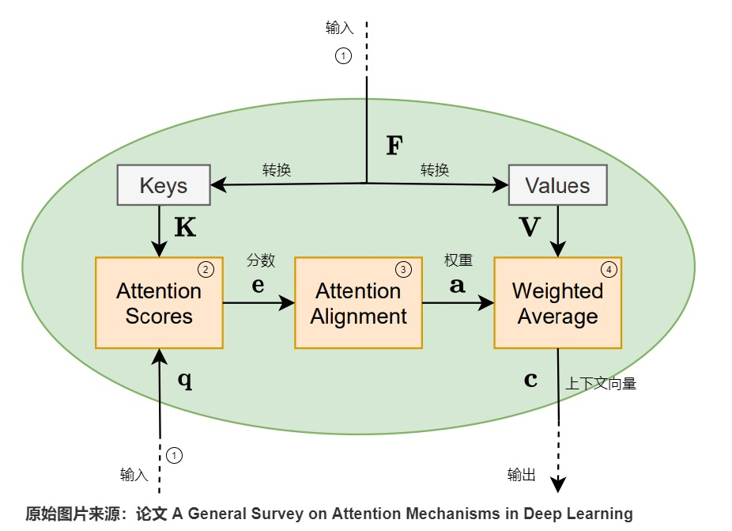

# 自我介绍
面试官您好，我是胡红利，2019年就读于长安大学计算机科学与技术专业，2023年攻读硕士学位，目前研二。
研究生阶段，我专注于计算机视觉与深度学习领域，深入学习了目标检测与位姿估计等视觉算法及相关检测框架，同时，我学习了扩散模型、自然语言处理及大模型的相关知识，并且参与了基于扩散模型的目标检测与位姿估计、文本模态视觉检测等项目。
目前一篇EI会议已发表，两篇会议在投，一篇中文一区期刊外审。在校期间多次参加国家级大赛并获得两项国家级、一项省级等奖项。以上是我的自我介绍，感谢您的聆听，您有需要问的我会认真回答。

# 项目

## 1. 基于扩散模型的目标检测与位姿估计算法
研究路侧交通场景下仅以单目RGB图像为输入的基于扩散模型的目标检测与位姿估计算法设计与应用，将目标检测与位姿估计转换为图像中边界框的位置和大小空间上的生成模型来解决问题，训练阶段将真值框扩散到随机分布，通过训练模型来逐渐逆转正向过程的影响，模型学习反转这个噪声过程，将一组随机生成的框细化到类别、目标框及位姿的输出结果。
### 1.1 网络结构
网络由一个图像编码器和一个多任务解码器组成。图像编码器使用 resnet 提取图像特征，并使用特征图金字塔FPN生成多尺度特征图。多任务解码器的输入为加入噪声后的二维框，从多尺度特征图中裁剪RoI特征，并经过MLP输出目标检测与位姿估计的预测结果。
训练阶段初始化一组2dbox，并逐步加入高斯噪声，得到噪声2dbox，并从图像编码器提取到的特征裁剪出感兴趣区域，将裁剪得到的特征送入到解码器中预测真值并计算loss。
再推理时，生成一组完全由高斯噪声生成的噪声2dbox，接着同样的步骤得到解码器预测的2dbox(xt)，采用ddim传入当前的噪声样本 xt 与预测的目标框 x0，预测上一时刻 xt-1 的数据分布，反复迭代直至0时刻。

### 1.2 DDIM

DDIM 通过重新设计前向过程，允许非马尔可夫链的跳跃路径，从而减少反向过程的迭代步数。
假设扩散过程的时间步总数为 T，在前向过程中，直接定义从初始状态 x0 到任意时间步 t 的映射：
$$\mathbf{x}_t = \sqrt{\bar{\alpha}}_t \mathbf{x}_0 + \sqrt{1 - \bar{\alpha}}_t \mathbf{\epsilon}, \quad \mathbf{\epsilon} \sim \mathcal{N}(\mathbf{0}, \mathbf{I})$$

其中，$\bar{\alpha}_t$ 是累积噪声调度参数（与 DDPM 相同）。

在反向过程中，通过预测初始状态 x0 和当前噪声 ${\epsilon}_{t}$ ，直接跳步生成下一步状态xt-1。

### 1.3 DETR

DETR 分为四个部分，CNN 的 backbone，Transformer 的 Encoder与Decoder，及预测层 FFN。在Decoder中选择固定的 N 个 token 作为输入，并行解码 N 个object，经过FFN 就能得到 N 个框的位置和类别分数。FFN 是由具有 ReLU 激活函数且具有隐藏层的 3 层线性层组成。DETR 预测了一组固定大小的 N 个边界框，因此将真值也扩展为N个并采用匈牙利算法进行二分图匹配，使得匹配损失最小。

### 1.4 Sparse rcnn

由基于ResNet结构的特征金字塔网络的主干网络、一个动态实例交互头和两个任务特定的预测层组成。一共有3个输入：一幅图像、一个建议边界框集合和一个建议特征集合。后两者是可学习的，可以与网络中的其它参数一起优化。可学习的建议边界框是一个固定的（N×4）集合，提供粗糙的目标位置。可学习的建议特征（N×d）是一个高维的潜在向量，被期望于对丰富的实例特征进行编码。 给定 N 个建议边界框，Sparse R-CNN首先利用池化操作为每个边界框提取特征，每个RoI特征被输入动态实例交互头进行目标定位和分类。

## 2. 基于轨迹时空图的无监督异常检测方法
基于工业领域无监督异常检测方法EfficientAD进行改进。EfficientAD由一个学生教师对和一个自编码器组成，自动编码器检测逻辑异常(产品的组装错误...)，而学生-教师模型检测粗粒度和细粒度的结构异常(产品物理缺陷...)。异常图是两个输出之间的平方差。将学生-教师对生成的异常图称为局部异常图，学生-自编码器生成的异常图称为全局异常图，取这两个异常图的均值来计算合并的异常图，并将其最大值作为图像级异常评分。使用注意力模块替换自编码器，在使用线性注意力模块时，取得了最佳性能。

### 2.1 PDN(TS架构)

特征提取器仅由四个卷积层组成，以完全卷积方式将其应用于图像可以在一次前向传递中产生所有特征。为了使 PDN 生成富有表现力的特征，将深度预训练分类网络提炼到其中。使用与 WideResNet-101中的 PatchCore相同的预训练特征。通过最小化PDN输出与从预训练网络中提取的特征之间的均方差来训练来自 ImageNet的图像。
训练学生网络来预测教师网络（教师网络经过预训练）在正常（即无异常）训练图像上计算的特征。由于学生网络没有接受过异常图像方面的训练，因此通常无法在这些方面模仿教师网络。因此，教师和学生的输出之间存在较大距离，因此可以在测试时检测到异常情况。

### 2.2 自编码器

使用标准的卷积自编码器，包括编码器中的跨步卷积和解码器中的双线性上采样。学生学习自动编码器在正常图像上的系统重建误差，例如模糊重建。同时，它不会学习异常的重建错误，因为这些不是训练集的一部分。这使得自动编码器的输出和学生的输出之间的差异非常 适合计算异常图。

### 2.3 异常图标准化

局部和全局异常图必须先标准化为相似的比例，然后再对其进行平均以获得组合异常图。为了估计正常图像中噪声的规模，使用验证图像，即训练集中未见过的图像。对于每一种异常图类型，计算验证图像上所有像素异常分数的集合。然后，为每个集合计算两个 p-分位数：pa 和 pb ，分别表示 p = a 和 p = b。我们确定一个线性变换，将 pa 映射到异 常分数 0，将 pb 映射到分数 0.1。在测试时，局部和全局异常图通过各自的线性变换进 行归一化。通过使用分位数，归一化对于正常图像上的异常分数的分布变得鲁棒。

### 2.4 Linear Attention

注意力机制通过计算查询向量与所有键向量的相似度，获得注意力权重，再用这些权重对相应的值向量进行加权组合。在此过程中使用softmax函数的目的是将原始相似度分数转换为概率分布，线性注意力将softmax指数函数重写为特征映射函数φ(x)=elu(x) + 1的点积形式的核函数，利用矩阵乘法的结合律，将注意力计算重构为线性形式。这种重构方法消除了计算完整N×N注意力矩阵的需求，将复杂度降低至O(Nd²)，其中d表示嵌入维度。

## 3. 基于单幅RGB图像的单、多目标三维视觉定位方法

鉴于三维视觉定位领域中主流数据集是基于室内场景的且基于单目标，而基于雷达采集架构部署成本高普适性差的问题，我们提出了一个基于RGB图像的单、多目标的三维视觉定位基准数据集，有效地弥补了基于单眼图像的3DVG的研究空白。此外这项工作提出了首个端到端基于单目图像的3DVG框架，旨在有效增强多尺度特征地图的语义引导感知。

U2ENet包括三个主要组件：多模态特征提取器，多尺度语义感知分层融合模块以及grounding head。在多模态特征提取器中，使用预训练的 roberta-based 模型提取文本表示序列，使用预训练的 CenterNet 视觉主干提取四个多尺度特征图。多尺度语义感知分层融合模块中，引入用于分层语义建模的状态空间对偶性（SSD）模块以缓解长依赖问题，
grounding-head采用多分支结构进行2d、3d属性的预测。

# 扩散模型

### 先验概念
- 马尔可夫链：状态空间中经过从一个状态到另一个状态的转换的随机过程。该过程要求具备“无记忆”的性质：下一状态的概率分布只能由当前状态决定，在时间序列中它前面的事件均与之无关。
- 极大似然估计：对于给定的观测数据x，从所有的参数θ1,θ2,θ3...中找出能最大概率生成观测数据的参数θ*作为估计结果。
- KL 散度：不对称统计距离度量，用于衡量一个概率分布 P 与另外一个概率分布 Q 的差异程度。
### 生成模型
- GAN：由一个生成器（generator）和判别器（discriminator）组成，生成器的任务是生成尽可能接近真实数据的假数据，而判别器的任务是区分输入数据是真实数据还是生成器生成的假数据。二者通过相互竞争与对抗，共同进化，最终生成器能够生成非常接近真实数据的样本。
- VAE：变分自编码器,基于概率图模型的生成模型，通过学习数据的潜在分布来生成新样本。它假设隐变量服从某种先验分布（如标准正态分布），并通过编码器将输入数据映射到隐变量的后验分布，再通过解码器将隐变量还原成生成样本。
- Flow：通过一系列可逆的变换，将简单分布（如均匀分布或正态分布）转换为复杂的数据分布。在训练阶段，通过最小化潜在空间中的样本与真实数据之间的损失函数来学习可逆变换的参数。
- Diffusion：将数据生成过程看作一个马尔可夫链。从目标数据开始，每一步都向随机噪声靠近，直到达到纯噪声状态。然后，通过反向过程，从纯噪声逐渐恢复到目标数据。
### 扩散模型常见采样方式？
   采样器可以大致归纳为两种：**概率模型**，如 DDPM、DDIM、PLMS 以及 DPM 系列模型。这类生成模型根据模型估计的概率分布来生成结果；**数值方法**，如 Euler、Heun和 LMS。将扩散过程建模为微分方程，通过数值解法逐步逼近解。这些方法在每一步中都致力于解决一个具体的数学问题，逐渐构建出解决方案。
- DDPM：基于马尔可夫链的前向（加噪）和反向（去噪）过程。反向过程通过训练神经网络逐步预测噪声，从纯噪声中恢复数据。
- DDIM：通过非马尔可夫链的重新参数化，打破DDPM的严格马尔可夫性，允许跳步采样。速度显著提升，且与DDPM共享模型权重。
- PLMS：利用多步历史信息预测当前去噪方向，通过线性组合多个噪声估计值加速采样。比DDIM更高效，稳定性较高。Stable Diffusion等开源模型的默认采样器。
- DPM：结合高阶泰勒展开和自适应步长策略，实现低步数的高质量生成。计算效率高，支持随机性（随机微分方程SDE）和确定性（常微分方程ODE）两种模式。
- LMS：利用多个历史步的梯度信息线性组合，估计当前步的解。减少单步计算量，但需存储历史状态，内存开销略高。
### 扩散模型能否使用其他噪声的加噪方式?
  扩散模型的核心是定义前向加噪过程（将数据逐步破坏为噪声）和反向去噪过程（从噪声恢复数据）。噪声类型需满足以下条件：1）可逆性：前向过程的每个步骤需能被反向过程近似；2）可解析的分布形式：需能推导出加噪后的数据分布和反向条件分布 ；3）训练损失可计算：例如，基于KL散度或得分匹配的目标函数需可优化。
常见替代噪声类型：伯努利噪声，在二值化数据（如文本的token序列或黑白图像）中，每一步以概率βt将像素/比特随机翻转（0→1或1→0）。反向过程需建模离散状态转移，无法直接使用连续梯度下降，常需引入Gumbel-Softmax(重参数化技巧)等技巧。案例：Bit Diffusion模型用于生成离散文本和分子结构。
### Diffusion加速方法?
   采样速度提升：改进采样策略或设计高效求解器，显著降低生成所需的迭代次数，如快速采样器（DDIM、DPM系列）等;
   模型架构优化：改进网络结构或降低计算复杂度提升推理速度，如轻量化U-Net设计、知识蒸馏等；
   数学方法改进：优化扩散过程的数学建模实现加速，如微分方程求解器优化（利用更高阶的数值方法或自适应策略，减少生成高质量样本所需的迭代步数）等。
### DDPM和DDIM的关系?
   差异：
   - 前向过程的差异：DDPM的前向过程是马尔可夫链，每一步添加高斯噪声，βt是预定义的噪声调度参数。DDIM引入非马尔可夫前向过程，通过重新参数化允许更灵活的噪声路径，μt和σt是隐式定义的参数，允许跳过中间步骤。
   - 反向过程的优化：DDPM反向过程严格依赖马尔可夫链，逐步去噪，需迭代计算所有中间步骤。DDIM通过隐式条件分布直接建模x0与xt的关系，允许跳步采样。
   
   联系：共享模型权重：DDIM可以直接复用DDPM的预训练模型，两者的训练目标一致（均通过预测噪声优化），仅采样策略不同。
   
### GAN和Diffusion的区别?
| 特性         | GAN                                           | Diffusion Model                                      |
|--------------|-----------------------------------------------|------------------------------------------------------|
| 基本思想      | 对抗训练：生成器（G）和判别器（D）通过博弈提升生成能力| 扩散过程：通过逐步加噪和去噪学习数据分布            |
| 生成过程      | 一步生成：直接输出样本（如从噪声向量到图像）| 多步迭代生成：逐步去噪（如从纯噪声恢复图像）|
| 训练目的      | 对抗损失：生成器欺骗判别器，判别器识别真假。|噪声预测损失：通过均方误差（MSE）优化模型对噪声的预测。|
| 训练过程      | 不稳定，易出现模式崩溃，但单步生成训练效率高|损失函数平滑，逐步优化，不易崩溃，模拟多步扩散过程，训练效率低|
### 为什么DDPM加噪声的幅度是不一致的?
加噪声的幅度不一致是由其扩散过程的数学设计和训练目标共同决定的。
- 1）扩散过程需要平滑过渡：通过逐步增大噪声幅度，扩散过程可以确保数据分布从原始分布平滑过渡到标准高斯分布。若所有噪声幅度都相同，可能导致过渡不平稳（如某些中间状态出现尖锐分布）。
- 2）训练目标的适配性：实际中需要覆盖从低噪声（接近原始数据）到高噪声（接近纯噪声）的所有情况。不一致的噪声幅度迫使模型在不同时间步学习不同程度的去噪操作。早期（低噪声）时，模型需修复细节（如纹理、边缘）；后期（高噪声）时：模型需捕捉整体结构（如物体形状）。
- 3）生成质量的优化：在生成阶段（反向扩散过程），若所有噪声幅度一致，可能导致模型在去噪时陷入局部最优（如生成模糊结果），且模型可能倾向于生成相似样本（模式坍塌）。动态噪声幅度鼓励多样性。
### 训练Stable Diffusion时为什么要使用offset Noise?
Offset Noise是指在标准高斯噪声的基础上，引入一个可学习的偏移量（通常通过调整噪声的均值或方差），从而改变噪声的分布特性。

$$
\epsilon_{\mathrm{offset}} = \epsilon + \delta \quad \text{或} \quad \epsilon_{\mathrm{offset}} = \epsilon \cdot \gamma + \delta
$$

$\epsilon \sim \mathcal{N}(0, I)$是标准高斯噪声；$\delta$是偏移量（可学习参数）；$\gamma$是缩放因子（可学习参数）。

使用Offset Noise的核心原因：
- 1）缓解训练中的过平滑问题：在扩散模型的去噪过程中，模型可能倾向于生成过于平滑的图像（丢失细节），尤其是当噪声强度较高时。通过Offset Noise调整噪声分布，迫使模型学习更复杂的噪声模式，从而保留高频细节（如纹理、边缘）。
- 2）增强模型对噪声分布的适应性：传统扩散模型假设噪声严格服从高斯分布，但真实场景中可能存在非对称或非高斯的噪声（如传感器噪声、压缩伪影）。Offset Noise通过引入偏移量或缩放因子，使噪声分布更灵活，模型能适应更广泛的数据分布。
- 3）改善训练稳定性：Offset Noise可调节不同时间步的噪声强度，避免某些时间步的梯度爆炸或消失（尤其在噪声强度剧烈变化时）。
- 4）提升生成多样性：Offset Noise增加了噪声的随机性组合，避免生成结果过于模式化（如人脸生成中的重复特征）。
### 推演DDPM公式
1）前向扩散过程

$$\mathbf{x}_t = \sqrt{\bar{\alpha}}_t \mathbf{x}_0 + \sqrt{1 - \bar{\alpha}}_t \mathbf{\epsilon}, \quad \mathbf{\epsilon} \sim \mathcal{N}(\mathbf{0}, \mathbf{I})$$

2）反向去噪过程

3）目标函数(ELBO)

## DeepSeek Janus Pro

## Nvidia Sana
Sana 是一个高效的文生图的框架，能以极快的速度合成高分辨率、高质量的图像，并具有很强的文本图像对齐能力。
核心设计：
- **深压缩自动编码器**：与只能将图像压缩 8 倍的传统自动编码器 AE 不同，Sana 训练的 DC-AE 可将图像压缩 32 倍，从而有效减少潜在标记的数量。
- **linear DiT**：用线性注意力取代了 DiT 中的自注意力，计算复杂度从 O(N^2) 降低到 O(N)，在高分辨率生成中提高了计算效率且不影响性能。
- **纯解码器文本编码器**：使用现代的纯解码器小型大型语言模型(LLM)如 Gemma 作为文本编码器，与传统的T5相比，仅解码器的 LLM 具有更强的文本理解和推理能力。
- **高效训练和采样**：提出多标题自动标记管道，为每个图像使用多个视觉语言模型（VLM）生成重新标题，然后基于剪辑分数（clip score）的采样策略，根据概率选择高质量的标题，提高了训练收敛性和文本 - 图像对齐。提出Flow - DPM - Solver，减少了推理采样步骤，同时取得了更好的结果。
###    

# 注意力
## 1. 背景知识

### 1.1 自回归模型

自回归（Autoregressive）模型是一种生成模型，遵循因果原则（当前单词只受到其前面单词的影响），利用一个变量的历史值来预测其未来的值，在每个时间步，模型根据之前生成的元素预测当前元素的概率分布。
自回归模式弊端：容易累积错误，导致训练效果不佳；难以并行化的方式开展训练、提升效率。

### 1.2 编码器-解码器

对于输入输出都是变长的序列，可以使用一个定长的状态机来作为输入和输出之间的桥梁。编码器-解码器架构：前半部分的RNN只有输入，后半部分的RNN只有输出（上一轮的输出会当作下一轮的输入以补充信息），两个部分通过一个隐状态（hidden state）来传递信息。优化目标函数为真值与预测值的距离度量函数，通常用MSE（均方方差）。

编码器把输入句子的所有语义信息压缩成一个固定长度的中间语义向量（也称为上下文向量或隐向量），该向量包含了可供计算与学习的、代表句子语言特点和含义的特征信息，是输入的浓缩摘要。解码器会把这个中间语义上下文向量解码成输出句子，即解码器将编码器学习到的特征信息再转化为相应的句子。
序列建模的核心就是研究如何把长序列的上下文压缩到一个较小的状态中。

输入层神经元的个数 n 大于隐层神经元个数 m 时，相当于把数据从 n 维降到了 m 维；然后利用这 m 维的特征向量，进行重构原始的数据。区别于 PCA 求解特征向量的线性降维，自编码是一种非线性降维。

### 1.3 技术挑战

CNN：卷积感受视野是局部的，学习空间数据中的局部依赖关系。
RNN：时序结构，后面的时刻天然就依赖于前面时刻的输出。
- 对齐问题：CNN和RNN都难以在源序列和目标序列之间做到完美对齐。
- 隐状态长度固定：RNN的隐向量大小固定，所以推理效果受限于信息压缩的能力，导致信息遗失。
- 关系距离问题：都存在。序列中两个词之间的关系距离不同，当词之间距离过长时，两个方案都难以确定词之间的依赖关系。使得当面临冗长且信息密集的输入序列时，模型在整个解码过程中保持相关性的能力可能会减弱。
## 2. 注意力机制

### 2.1 普通注意力

注意力机制确保每个解码步骤都由最相关的上下文片段提供信息，解决了长距离依赖问题，但其计算速度慢、存储占用高。
本质：上下文决定一切；核心思想：为输入的不同部分分配不同的权重，以提取关键信息，让模型判断更精准，更加节省算力和存储。
query、key、value 代表相关向量，用**Q**（查询矩阵）、**K**（键矩阵）、**V**（值矩阵）代表相关向量构成的矩阵，名义上的称呼代表使命，本质都是输入矩阵。
计算流程：
- ① 是输入（两个输入），从输入生成的特征向量F会进一步生成键矩阵K和值矩阵V。
- ② 使用矩阵 **K** 和查询向量 **q** 作为输入，通过相似度计算函数来计算注意力得分向量 **e** 。**q** 表示对信息的请求，**el** 表示矩阵 K 的第 **l** 列对于 **q** 的重要性。
- ③ 通过对齐层（比如softmax函数）进一步处理注意力分数，进而得到注意力权重a。
- ④ 利用注意力权重 **a** 和矩阵 **V** 进行计算，得到上下文向量**c**。

交叉注意力（Transformer解码器、跨模态）关注不同序列之间的注意力，自注意力机制（BERT、ViT）用于捕捉同一序列内部元素之间的依赖关系，多头注意力（所有Transformer模块）通过并行多个独立的注意力头（原来向量等分，并行处理，互不干扰），从不同子空间学习多样化的特征表示，增强模型表达能力。

### 2.2 线性注意力

注意力机制通过计算查询向量与所有键向量的相似度，获得注意力权重，再用这些权重对相应的值向量进行加权组合。在此过程中使用softmax函数的目的是将原始相似度分数转换为概率分布，这在本质上类似于k近邻机制，即相关性更高的键值对获得更大的权重。标准注意力机制需要对NxN维度的矩阵执行softmax运算，这导致计算复杂度随序列长度呈二次方增长。虽然这种计算复杂度对于较短序列是可接受的，但在处理长度达到100k以上的序列时，计算效率会显著降低。

**将softmax指数函数重写为特征映射函数φ(x)=elu(x) + 1的点积形式的核函数**，**并利用矩阵乘法的结合律，将注意力计算重构为线性形式**。这种重构方法消除了计算完整N×N注意力矩阵的需求，将复杂度降低至O(Nd²)，其中d表示嵌入维度。

局限：由于状态矩阵的维度限制为d × d，其信息存储容量存在上限。比如：如果原始上下文需要存储20d²的信息量，在压缩过程中将不可避免地损失19d²的信息。**通过维持固定维度的状态矩阵获得计算效率的同时，也限制了上下文信息的保存能力。**

### 2.3 门控线性注意力

在使用固定维度状态矩阵优化计算效率的过程中，信息损失是不可避免的，但可以通过一种选择性信息过滤机制（门控函数），智能地选择需要保留的信息来最小化信息损失的影响。门控函数仅依赖于当前token和可学习参数，而不需要考虑完整的序列历史。由于各个token的门控计算相互独立，这种设计实现了训练过程的高效并行化，使得序列中所有token的门控运算能够同时进行。

参考：
（注意力机制）https://www.cnblogs.com/rossiXYZ/p/18705809
（扩散模型）https://tanxy.club/Diffusion-Model

